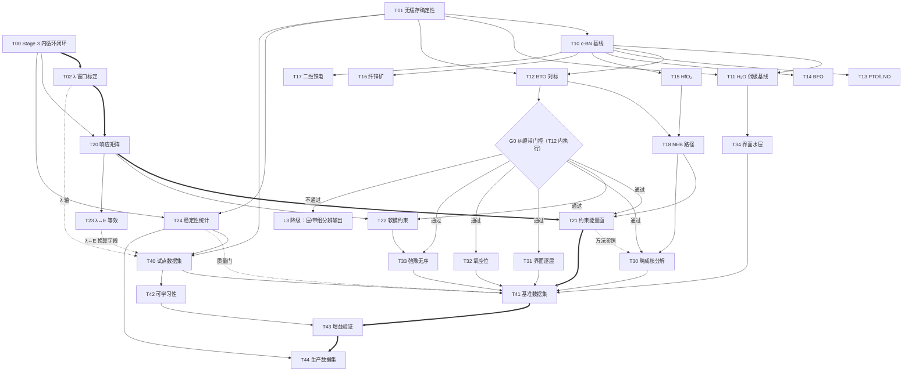
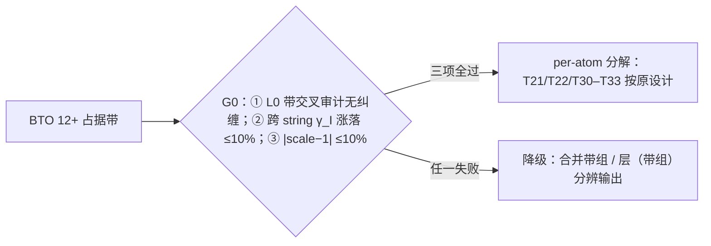
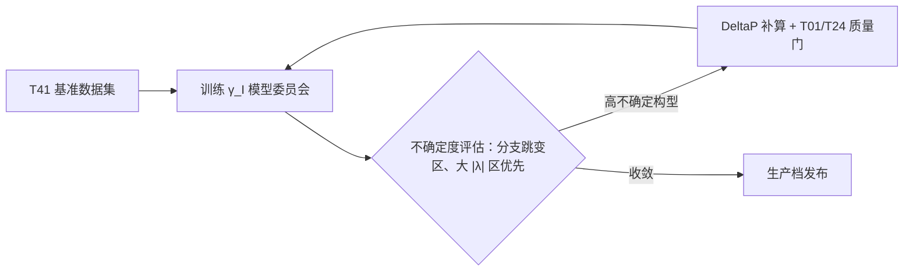

# DeltaP 测试任务分解——27 张任务卡（算例 / 工作流 / 对标分析 / 阻塞调度）
> 配套文档：《DeltaP 方法极化性质测试计划》《DeltaP 算法 Notes 与批判性风险分析》（2026-07-18）· 完稿日期 2026-07-18

## 零、任务总览与并行调度

本节将《DeltaP 方法极化性质测试计划》分解为可照章实施的任务卡：编号 T00–T44 分五段，按权威依赖矩阵总表计 27 张（以 taskcards-dependency-matrix.md 总表为准）。每张卡固定四要素：算例（体系与关键计算设置）、测试细节与工作流（参数级步骤）、对标与分析方式（基准、定量判据、失败归因）、意义与调度（阻塞于／阻塞／并行性），使任一卡可独立执行与裁决。分级沿 Phase 0→L1→L2→L3→L4 递进：Phase 0（T00–T02）为前置门控，对应生死关①②⑤（见 deltap-notes_sec06.md §6.2），裁决约束闭环、无缓存确定性与 λ 量程三项采信资格；L1（T10–T18）为基线对标，引入 Berry-phase／Wannier90 外部裁判；L2（T20–T24）验证 per-atom λ 调控独有能力；L3（T30–T34）为机制研究，其中 T30–T33 粒度由 G0 纠缠带门控裁定，T34 改受氢分区修复门控；L4（T40–T44）按 10²→10³→10⁴ 三档生产数据集。

**表 0-1 任务总览表**（逐行转写自依赖矩阵任务总表：「阻塞于」=开工前必须完成的任务，「阻塞」=等待其完成的下游任务；依赖关系未作任何改动）

| ID | 任务名称 | 层级/批次 | 算例一句话 | 阻塞于 | 阻塞（下游） |
|----|---------|----------|-----------|--------|-------------|
| T00 | Stage 3 内循环首次闭环验证 | P0 / 批0 | c-BN 3×3×3，λ 约束目标 | — | T02、T20、T21、T22、T23、T24 |
| T01 | 无缓存确定性验证 | P0 / 批0 | c-BN 3×3×3，删缓存全新 ×3 | — | 全部定量任务（质量门，尤其 T10、T24、T40） |
| T02 | λ 可控窗口标定 | P0→L2 / 批0.5 | c-BN + H₂O，λ∈±{0.01,0.05,0.1,0.5} | T00 | T20、T21、T22、T40(λ 轴) |
| T10 | c-BN 基线对标 + W90 对标 + 密网格 | L1 / 批1-先 | c-BN ≥3×3×3 | T01 | T12、T13、T14、T15、T16、T17（流程参考） |
| T11 | H₂O 分子偶极基线 | L1 / 批1 | 孤立 H₂O 大盒子 | T01、T10 | T34 |
| T12 | BaTiO₃ 自发极化对标 + G0 纠缠带门控 | L1 / 批1 | 四方 BTO 5 原子胞 | T10、T01 | T18(BTO)、T21、T22、T30、T31、T32、T33（G0） |
| T13 | PbTiO₃ / LiNbO₃ 分支量子测试 | L1 / 批1 | PTO 四方 + LiNbO₃ | T10 | —（独立对标） |
| T14 | BiFeO₃ 强关联体系对标 | L1 / 批1 | BFO R3c | T10 | — |
| T15 | HfO₂ 铁电相对标 | L1 / 批1 | HfO₂ Pca2₁ 相 | T10 | T18(HfO₂) |
| T16 | 纤锌矿 ZnO/GaN/AlN 压电测试 | L1 / 批1 | 三个 wz 体系 | T10 | — |
| T17 | 二维与滑移铁电测试 | L1 / 批1 | h-BN 单/双层、MoS₂、In₂Se₃ | T10 | — |
| T18 | NEB 翻转路径极化曲线 | L1 / 批1.5 | BTO + HfO₂ NEB 路径 | T12、T15 | T21（势垒对照）、T30 |
| T20 | dγ_I/dλ_J 响应矩阵测量 | L2 / 批2-先 | BN/H₂O 多原子 λ sweep | T00、T02 | T21、T22、T23 |
| T21 | 约束能量面 E(γ_I) Landau 双势阱 | L2 / 批2 | BTO 单 Ti 约束扫描 | T20、T12(G0)、T18 | T30（方法参照）、T41（构型池） |
| T22 | 软模协同约束模式能量面 | L2 / 批2 | BTO 软模本征矢投影约束 | T20、T12(G0) | T33 |
| T23 | λ↔外加电场等效性验证 | L2 / 批2 | BN/BTO：λ 约束 vs 有限场 | T20 | T40（schema 中 λ↔E 换算字段） |
| T24 | 稳定性与 SCF 收敛率统计 | L2 / 批2 | BN+BTO，各 λ 档 ×10 重复 | T00、T01 | T40、T41、T44（质量门） |
| T30 | 铁电畴成核逐原子分解 | L3 / 批3 | BTO NEB 逐像 per-atom γ | T18、T12(G0) | T41（构型池） |
| T31 | BTO/STO 界面电荷逐层分解 | L3 / 批3 | (BTO)₅₋ₙ/(STO)ₙ 超晶格 | T12(G0) | T41 |
| T32 | 氧空位局域极化畸变 | L3 / 批3 | BTO 3×3×3 超胞 + 单 V_O | T12(G0) | T41 |
| T33 | 弛豫铁电局域极化无序统计 | L3 / 批3 | PMN-PT 类大超胞 | T22、T12(G0) | T41 |
| T34 | 界面水层逐分子极化分解 | L3 / 批3 | 表面水层/溶剂化界面 | T11 | T41 |
| T40 | 试点数据集（10² 构型） | L4 / 批4-先 | BN + H₂O（λ=0 轴先行） | T01、T24 | T41、T42 |
| T41 | 基准数据集（10³ 构型） | L4 / 批4 | + BTO 家族构型池 | T40、T21、T30、T31、T32、T33、T34 | T43、T44 |
| T42 | per-atom 标签可学习性验证 | L4 / 批4 | T40 数据训练 NequIP/MACE | T40 | T43 |
| T43 | per-atom 标签增益验证（相变/IR） | L4 / 批4 | T41 数据对照训练 | T42、T41 | T44 |
| T44 | 生产数据集（10⁴ 构型）+ 主动学习闭环 | L4 / 批4 | 全体系 + AL 循环 | T43、T24 | — |

总表呈「三门控—两枢纽—多叶」结构。T00/T01/T02 先于一切定量结论：T01 阻塞面最大（全部定量任务的质量门），T00 卡住全部 λ≠0 测试，T02 决定 L2 量程与 L4 的 λ 轴。两张枢纽卡须优先保障：T12 扇出 7 项下游（其中 6 项经 G0 支配），失败将同时瘫痪 L2 能量面类与 L3 机制类；T41 扇入 7 项上游，是 L2/L3 构型池的总汇。T13、T14、T16、T17 无下游，属独立对标叶卡，可安插于批 1 空闲算力。须注意 G0 并非独立任务，而是 T12 内执行的判断环节：通过与否决定 BTO 家族 L3 卡按 per-atom 输出还是降级为层/带组分辨输出，但不阻断 L4 构型入池（见 deltap-testplan_sec06.md §6.2）。

**依赖 DAG**（实线=「阻塞于」硬依赖，粗线=关键路径，虚线=带限定词的软引用；G0 画为判断菱形，全图无环，与矩阵拓扑序一致）：

图中三类边须区分读：硬依赖取自各卡「阻塞于」列，缺一不开工；虚线软引用（T21→T30 方法参照、T02→T40 的 λ 轴、T23→T40 的 λ↔E 换算字段、T24→T41 质量门）仅表数据与口径衔接，不构成开工门槛；T00 对 T21–T23 的阻塞经 T20 传递，不另画边；T02 对 T21、T22 同理。G0「不通过」支路指向降级输出叶节点，不产生新阻塞，全图保持无环。

**表 0-2 并行批次表**（批 0→批 4，转写自依赖矩阵调度结论）

| 批次 | 可并行任务 | 启动条件 | 关键路径说明 |
|:---:|:---|:---|:---|
| 批 0 | T00 ∥ T01（互不依赖） | 无前置，即刻启动 | T00 为关键路径首环；T01 为质量门，裁决历史证据采信资格 |
| 批 0.5 | T02 | T00 通过 | 关键路径第二环；与批 1 的 T10 链并行推进 |
| 批 1 | T10 先行 → T11∥T12∥T13∥T14∥T15∥T16∥T17 全并行 | T01 通过；T12 另需 T10 | 基线对标主体；T12 内执行 G0，决定 L3 输出粒度 |
| 批 1.5 | T18 | T12+T15 | NEB 路径，衔接 L1 与 L2/L3 |
| 批 2 | T20 先行 → T21∥T22∥T23；T24 可提前启动 | T20 等 T00+T02；T21 另等 T12(G0)+T18；T22 另等 T12(G0)；T24 等 T00+T01 | T20→T21 为关键路径中段；T24 为批 4 前置 |
| 批 3 | T30∥T31∥T32∥T33∥T34 全并行 | 各等自身门控（T12(G0)/T18/T22/T11） | 产出构型池汇入 T41 |
| 批 4 | T40 → T41∥T42 → T43 → T44 | T40 等 T01+T24；T41 等 T40+T21+T30–T34；T42 等 T40；T43 等 T41+T42；T44 等 T43+T24 | T41→T43→T44 为关键路径末段；T41∥T42 是 L4 唯一并行窗口 |

关键路径为 **T00→T02→T20→T21→T41→T43→T44**：T00 是 λ≠0 测试的总闸门，T02 只能串行其后，T20 需 T00+T02 双输入，T21 汇齐 T20、G0、T18 三路，T41 为构型池总汇，T43、T44 依次串行收尾；链上环环硬门控，批内并行无法缩短，最短工期由该链决定。调度的实际弹性在两处：其一，批 0.5 与批 1 可重叠——T02 等 T00、T10 等 T01，两链互不依赖，可同日推进；其二，T24 仅等 T00+T01，可提前插入批 1 空闲窗口，为批 4 的 T40 提前解锁。若 T00 超期（1–2 开发周期无首次闭环），走「L2 冻结、定位 λ=0 诊断工具」降级分支后，批 2 全部冻结（T24 亦阻塞于 T00）；可继续项为 L1 的 λ=0 对标收尾、T30（4.1）、T40 的结构扰动/AIMD 两轴采样（5.2）与 WC 兼容标签（5.3）（见 deltap-testplan_sec06.md §6.2）。

## 一、Phase 0 前置门控任务（T00–T02）

三张卡对应生死关①②⑤，是全计划的总闸门：T01 裁决历史证据的采信资格，T00 裁决 DeltaP 是「约束算法」还是「诊断工具」，T02 裁决 λ 是「控制旋钮」还是「微扰探针」。

### T00 Stage 3 内循环首次闭环验证

**层级**：Phase 0 前置门控 ｜ **并行批次**：批 0

**1. 算例**：闪锌矿 c-BN 原胞（2 原子），PBE 泛函，k 点 3×3×3=27（同 Stage 2 条件，symmetry=-1 启用全网格，见 2026-07-13-deltap-test-data.md），scf_thr=1e-8；mixing_beta=0 冻结电荷，隔离内循环与电荷–λ 耦合；λ_init=0.05，γ_target=−0.080 rad（基线 γ0≈−0.085 rad 上加 +0.005 rad 位移，与单步控制信号同量级、落在既有线性窗口内）。

**2. 测试细节与工作流**：

1. 预跑 λ=0 SCF 至收敛并冻结 deltap_match.dat：内循环每步 solve 产生新相位，复用冻结 match_to[] 残差评估才一致（见 2026-07-17-deltap-innerloop-analysis.md）。
2. segfault 调试预案（三步调试序，见 deltap-notes_sec03.md §3.5）：先以 deltap_nscf=1 试跑，solve 前 psi->fix_k(0) 重置并清零 eband（及 demet）；仍 segfault 则每次内迭代新建 HSolverLCAO 对象（fresh solver）；可解即确认 solver 状态重用根因，固化后升 deltap_nscf=5。
3. 内循环 BFGS：bfgs.start_outer(λ_init) 后每步由 bfgs.step(residual) 给试探 λ，residual=γ_target−γ；set_lambda+update_lambda 触发 dp_hr_done 增量更新（HR+=dλ×τ×pre_hr，不动电荷），重新对角化测 γ，交回 bfgs.accept_trial；循环结束置 skip_solve=true 回正常电荷更新。
4. 逐内迭代落盘 λ、γ、|γ−target|，供单调性裁决。

**3. 对标与分析方式**：基准为 λ=0 冒烟基线（15 轮收敛、γ0=−0.085 rad，见 2026-07-13-deltap-test-data.md）与内循环历史最优（冻结电荷 maxdev 0.0478→0.0134，外循环反弹，同出处）。通过判据（生死关①，见 deltap-notes_sec06.md §6.2）：λ≠0、deltap_nscf≥5 完成一次 |γ−target| 随内迭代单调递减的约束收敛，且末态相对误差 |γ−γ_target|/|γ_target−γ0|<10%（绝对残差 <5×10⁻⁴ rad）。失败归因三分支：仍 segfault→按 fix_k 状态／eband 非零／ψ 数组破坏三候选根因逐一复核；单调性破缺且伴相邻步残差 >0.1 rad→判分支误选，回查匹配冻结；内循环收敛而外循环反弹→电荷–λ 耦合失稳（历史失效模式），转增广拉格朗日预案（仅见于口头，见 2026-07-15-deltap-progress-record.md）。

**4. 意义与调度**：一切 λ≠0 测试的总闸门——不过则 L2 冻结、算法退化为 λ=0 分解诊断工具（见 deltap-testplan_sec06.md §6.1）；**阻塞于**：—（无前置）；**阻塞**：T02、T20、T21、T22、T23、T24（T21–T23 经 T20 传递）；**并行性**：与 T01 完全并行（批 0，互不依赖）。

### T01 无缓存确定性验证

**层级**：Phase 0 前置门控 ｜ **并行批次**：批 0

**1. 算例**：同 T00 的 c-BN 原胞（PBE、k 3×3×3、scf_thr=1e-8），λ=0；mixing_beta=0 冻结电荷使哈密顿量与波函数逐轮全同，γ 逻辑上必须全同（B16 决定性实验设计，见 2026-07-13-deltap-test-data.md）；固定同一二进制与进程数运行，排除 MPI_Allreduce 归约序干扰（候选根因之一，见 2026-07-13-deltap-risk-review-evaluation.md）。

**2. 测试细节与工作流**：

1. 删除 deltap_branch.dat 与 deltap_match.dat（及全部缓存残留），同一输入全新运行 3 次。
2. 每次运行落盘四级诊断输出：Wilson 矩阵 Frobenius 范数 ||W||_F、Wilson 本征值 evals（arg 排序前后两版）、逐带 γ_n 与 per-atom γ_I、Hungarian match_to[] 序列。
3. 三运行两两逐级比对：||W||_F→evals 排序→match_to[]→γ，定位非确定性出现的层级（矩阵构建／对角化排序／匹配／分支）；并记录最小本征值相位差，<10⁻¹⁴ 即近简并警戒（见 2026-07-13-deltap-branch-selection-deep-dive.json）。

**3. 对标与分析方式**：通过判据为三次运行 max|Δγ|<10⁻¹⁰（3.5a／生死关②，见 deltap-testplan_sec03.md §3.5、deltap-notes_sec06.md §6.2）；该判据 07-13 已列出、截至 07-17 无任何通过记录（见 2026-07-13-deltap-status-and-todo.md）。历史失败基线：三次运行 γ0=+0.098/−0.062/−0.098（同前）。归因与诊断层级一一对应：||W||_F 不一致→Newton–Schulz 浮点非结合性或编译器浮点重排；evals 一致而 match_to[] 不同→近简并下排序/匹配失稳；γ 跳变量级 2π·w_In（0.1–4.5 rad）→分支误选，回查 L1–L4 防御缺层。

**4. 意义与调度**：全部定量结论的采信资格门——不过则历史结果一律标注「缓存回放嫌疑」（见 DeltaP 算法 Notes 第五章）；**阻塞于**：—；**阻塞**：全部定量任务（质量门，尤其 T10、T24、T40）；**并行性**：与 T00 并行（批 0），不依赖内循环，可全计划最先执行（见 deltap-notes_sec06.md §6.3）。

### T02 λ 可控窗口标定

**层级**：Phase 0 前置门控（P0→L2 过渡） ｜ **并行批次**：批 0.5

**1. 算例**：双体系——c-BN 原胞（PBE，k 3×3×3）与孤立 H₂O（≥15 Å 真空盒，Γ 点；两 H 被 SMO 投影合并为同一有效原子 nat=2，见 2026-07-13-deltap-stage1-bn-h2o.md）；scf_thr=1e-8；λ∈±{0.01,0.05,0.1,0.5} 八档，逐原子单独施加（BN 逐 B/N，H₂O 逐有效原子）；主模式 mixing_beta=0 冻结电荷，每档补 mixing_beta=0.4 对照以分离弛豫放大（见 deltap-testplan_sec03.md §3.1）。

**2. 测试细节与工作流**：

1. λ=0 基线：冻结电荷下复现 BN γ0≈−0.085 rad（见 2026-07-13-deltap-test-data.md），不复现则回退 T01 查确定性。
2. 逐档独立运行：deltap_lambda_step=0.0，各 λ 点自零初始电荷独立起算（同 Stage 2 协议，排除档间状态继承）。
3. 每档记录逐带 γ_n、per-atom γ_I 与 g0；相邻 λ 档残差 >0.1 rad 判分支跳变（阈高于单步信号、低于最小跳变量级 2π·w_In，依据见 deltap-testplan_sec03.md §3.1）。
4. 窗口内拟合：|λ|≤0.10 各档对 γ(λ) 线性回归，报 dγ/dλ 与 R²；λ=0.5 档专职复现/定位窗口上界；符号成对档检验响应方向对称性。
5. H₂O 同协议复测，顺带检验对称等价原子的可寻址性。

**3. 对标与分析方式**：对照三组既有观测——dγ/dλ≈0.05–0.10 rad/λ 工作区间（分段值 0.102/0.104/0.052，见 2026-07-13-deltap-test-data.md）；λ=0.5 分支跳变（g0 由 −1.161 跳至 +1.706，见 2026-07-15-deltap-progress-record.md）；λ=5 反号（−0.077，扩展参照，同前）。通过判据（生死关⑤）：窗口内线性 R²≥0.99；给出带模式归属的统一 dγ/dλ，消解 0.02–0.3 rad/λ 三口径矛盾（冻结电荷裸响应 0.02 见 2026-07-15-deltap-progress-record.md，0.1–0.3 见 2026-07-13-deltap-risk-review-rebuttal.md）；定量输出窗口上界与可控量程，边界与反号点记录为量程而非失败。失败归因：R² 不达标→借逐带诊断区分「HK 线性化失效」与「分支防御失效」（两种解释从未被区分，见 DeltaP 算法 Notes 第五章 §5.2）；跳变点与既有记录不符→回查匹配冻结与 k 网格口径。

**4. 意义与调度**：把 λ 从微扰参数标定为控制旋钮，量程直接决定 T21 双阱扫描可行性与 T40 λ 轴采样设计；**阻塞于**：T00；**阻塞**：T20、T21、T22、T40(λ 轴)；**并行性**：批 0.5，T00 通过即启动，与批 1 的 L1 基线链并行。

---

## 二、L1 基线对标任务

本章 9 张卡片（T10–T18）覆盖测试计划第二章全部基线套件：T10 批 1 先行，T11–T17 全并行，T18 待 T12+T15 后启动（批 1.5）。三方法（Berry-phase、Wannier-center、DeltaP）在统一结构/泛函/k 点/赝势下对标（公平性规则见 deltap-testplan_sec02.md §2.6）；DeltaP 在 L1 阶段仅考核 λ=0 无约束总量与定性分解，因 Stage 3 约束收敛迄今零成功（见 2026-07-15-deltap-progress-record.md）。

### T10 c-BN 基线对标 + Wannier90 对标 + 密网格验证
**层级**：L1 基线对标 ｜ **并行批次**：批 1（先行）
**1. 算例**：c-BN 闪锌矿 2 原子原胞（F4̄3m），PBE，k 点自 2×2×2 起步、验收网格 ≥3×3×3（该网格 γ 系统误差约 0.03 rad，见 2026-07-13-deltap-risk-review-evaluation.md）；SCF 须严格收敛（修复版已有 iter 21 收敛记录，B=1.53、N=1.85，见 2026-07-15-deltap-progress-record.md）。
**2. 测试细节与工作流**：(1) DFPT 与 ±0.005 Å 中心差分两路算 $Z^*$；(2) Berry-phase 与 Wannier90（MLWF）算总极化；(3) DeltaP λ=0 无约束算 $\sum_I\gamma_I$ 经 zeta rescaling 重构总量（见 2026-07-13-deltap-stage1-bn-h2o.md）；(4) 2×2×2→3×3×3→4×4×4 密网格序列验证 $P_{\text{total}}\to0$；(5) 无缓存全新运行 ×3 复验确定性。
**3. 对标与分析方式**：

| 测量量 | 基准值（来源） | DeltaP 现状（内部文档） | 定量通过判据 |
|---|---|---|---|
| $Z^*$（B/N） | +1.926 / −1.926（PBE DFPT，exciting 教程） | 尚未计算 | 各向同性偏差 <1%；$\lvert\sum Z^*\rvert<0.01\,e$ |
| 总极化 | 0（$T_d$ 对称） | 剩余 $P=+1.185\times10^{-2}$ a.u.≠0 且无解释（见 2026-07-13-deltap-rotation-test.md） | Berry↔W90 互差 <2%；DeltaP 与 Berry 互差 <2% 且密网格下 $P\to0$ |
| 确定性 | — | 旋转测试三次 8 位有效数字全等，但取自 SCF 未收敛条件 | 三次全新运行 $\max\lvert\Delta\gamma\rvert<10^{-10}$ |

c-BN 无内应变自由度、$Z^*$ 为标量，是声学求和规则与实现正确性最干净的检验；剩余 0.012 a.u. 极化能否随 k 点加密消失，直接区分「截断误差」与「实现缺陷」两种解释——若不趋 0，DeltaP 后续全部定量结论降级为诊断性证据（见 deltap-testplan_sec02.md §2.6），故本卡是全 L1 的证据等级阀门。
**4. 意义与调度**：L1 流程模板，其四要素工作流与 W90 锚定步骤被 T12–T17 逐一复用；**阻塞于**：T01（确定性质量门）；**阻塞**：T12–T17（流程参考）；**并行性**：批 1 唯一先行任务，完成后释放 7 张并行卡。

### T11 H₂O 分子偶极基线
**层级**：L1 基线对标 ｜ **并行批次**：批 1
**1. 算例**：孤立 H₂O 置于 ≥15 Å 立方真空盒（12/15/18 Å 序列做盒尺寸收敛），Γ 点，加偶极修正，PBE；分子取实验构型并置于 xz 平面（$P_y\approx0$ 为对称性自检项）。
**2. 测试细节与工作流**：(1) 单点能 + Berry-phase 按周期码大盒约定算分子偶极 $\mu$；(2) Wannier-center 按 O/H 归属分解；(3) DeltaP 输出 per-atom $\gamma_O$、$\gamma_H$ 并核对 $P_y$；(4) 三套结果统一以 Debye 报告，区分「分子偶极矩」与「极化密度」两套单位约定。
**3. 对标与分析方式**：实验 1.855 D（NIST CCCBDB）；CCSD(T) 1.90、DFT 1.8–1.9 D（Hait & Head-Gordon, JCTC 14, 1969 (2018)）。DeltaP Stage 1 已有 O/H=1.65，较预期 1.8 偏低约 8%（原文归因 SMO 权重和不为 1 的基组不完备性，见 2026-07-13-deltap-stage1-bn-h2o.md）；修复版因大盒对角化过慢仅 9 轮未收敛，但 O/H≈1.65 与 $P_y\approx0$ 保持（见 2026-07-15-deltap-progress-record.md）。本卡将该已有结果升级为定量判据：三方法 $\mu\in1.8$–1.9 D；DeltaP 排序 H<O 且 O/H≥1.7；盒尺寸 15→18 Å 下 $\mu$ 变化 <1%。
**4. 意义与调度**：孤立分子是 Berry/WC 非周期极限处理与 DeltaP per-atom 分配的最小公共算例，为 T34 界面水层逐分子分解提供单分子基准与 O/H 分配校准；**阻塞于**：T01、T10；**阻塞**：T34；**并行性**：批 1，与 T12–T17 全并行。

### T12 BaTiO₃ 自发极化对标 + G0 纠缠带门控
**层级**：L1 基线对标 ｜ **并行批次**：批 1
**1. 算例**：四方 BTO 5 原子原胞（P4mm），主泛函 PBEsol，另加 LDA/PBE 对照（各自弛豫结构）；k ≥6×6×6，Berry 沿 c 轴 k 串加密至 20 点；$P_s$ 经顺电立方参考绝热路径（≥5 中间构型）连续展开。
**2. 测试细节与工作流**：(1) 三泛函弛豫 + 三方法总量 $P_s$；(2) DFPT/差分算 $Z^*$ 全张量；(3) W90 互验；(4) DeltaP λ=0 总量与合并带组分解；(5) 执行 G0 门控（见下）。
**3. 对标与分析方式**：

| 泛函/来源 | $P_s$ (μC/cm²) | 来源 |
|---|---|---|
| 实验（T 相单晶） | 26–27 | arXiv:1511.02970 |
| LDA | 27 | GPAW 教程 |
| PBEsol | 22.9 | par.nsf.gov/10132582 |
| PBE | 45 | GPAW 教程 |

泛函散差是最大不确定度：LDA/PBE 相对实验偏差约 −11%/+74%（Zhang et al., PRB 96, 035143 (2017)），远超数值收敛误差，故「复现文献」必须绑定泛函与体积声明。$Z^*$ 另对标 Ti +7.32、O∥ −5.78（立方，Ghosez et al., PRB 60, 836 (1999)）。判据：Berry↔W90 互差 <2%、复现同泛函文献 ±10%；$Z^*$(Ti)>+5、O∥∈−5 至 −6 且三方法互差 <5%；DeltaP 因 12 条以上占据带纠缠、逐带追踪数学上无唯一答案（见 2026-07-15-deltap-branch-uniqueness-analysis.md），仅要求合并带组总量与电负性排序。

G0 门控（全计划最重要分叉点）：

纠缠检测手段：相邻 k string 间带对 SMO 权重和 w_sum 的差异谱，加 Hungarian 匹配 cost 二义性检查（简并附近配对走向不同，per-atom γ 跳变 $2\pi w_n^I$，见 2026-07-13-deltap-branch-selection-deep-dive.json）；判据②③窗口取自 deltap-testplan_sec04.md 章首（参照跨 string 涨落实测 10–30%、scale≈0.9–1.1，见 2026-07-15-deltap-branch-concepts.md）。
**4. 意义与调度**：BTO 是全计划机制研究主体材料，G0 结论一次性决定下游 6 张卡的测量粒度；**阻塞于**：T10、T01；**阻塞**：T18(BTO)、T21、T22、T30、T31、T32、T33（G0）；**并行性**：批 1，与 T13–T17 并行。

### T13 PbTiO₃ / LiNbO₃ 分支量子测试
**层级**：L1 基线对标 ｜ **并行批次**：批 1
**1. 算例**：四方 PTO 5 原子原胞（c/a≈1.063）与 LiNbO₃ R3c 原胞；PBEsol 主，PTO 加 LDA 对照；k ≥6×6×6；绝热路径 ≥5 中间构型（LiNbO₃ 取 R3c↔R3̄c 参考）。
**2. 测试细节与工作流**：(1) 先做单点 Berry（预期 LiNbO₃ 落错支路，用于检验流程捕获能力）；(2) 沿路径逐段展开，相邻 $|\Delta P|$ 小于半量子；(3) 报告 $P_s$ 与支路指标 $n$；(4) $Z^*$ 全张量；(5) DeltaP 总量与支路选择比对。
**3. 对标与分析方式**：PTO $P_s$ 实验 ~75 μC/cm²（RT）、DFT 88–99（LDA 0.89、SIESTA 0.96、ABINIT 0.99 C/m²；arXiv:1305.0240、arXiv:2505.08436）；$Z^*$ Pb +3.87、Ti +7.04（Ghosez et al., PRB 60, 836 (1999)）。LiNbO₃ $P_s$ 实验 71±2、PBE 78.31，而极化量子 $ec/\Omega=69.80$ μC/cm²（PMC10770415）——$P_s$ 超过量子，单点 Berry 必然落错支路，是支路展开的教学级检验；BTO 量子 $e/a^2\approx1.0$ C/m² 远大于 $P_s$（T12），可作单点对照。判据：PTO 复现 ±10%；LiNbO₃ 展开后落入 70–86 μC/cm² 且 $n$ 声明正确；三方法支路选择一致。
**4. 意义与调度**：唯一能强制暴露支路处理缺陷的 L1 算例；**阻塞于**：T10；**阻塞**：无（独立对标）；**并行性**：批 1 并行。

### T14 BiFeO₃ 强关联体系对标
**层级**：L1 基线对标 ｜ **并行批次**：批 1
**1. 算例**：BFO R3c 原胞（10 原子），LSDA+U（U 值随结果一并声明），G 型反铁磁序；k ≥4×4×4；$P_s$ 沿 [111] 绝热路径展开，自旋 up/down 相位分别处理（区间加倍，见 r1-materials.md §5）。
**2. 测试细节与工作流**：(1) 固定 U 弛豫 + 三方法 $P_s$；(2) U ±1 eV 敏感性扫描（$P_s$ 预期变化 ~10%）；(3) 路径逐点带隙检查（U 不足可致中间态金属化，Berry 相失效）；(4) $Z^*$；(5) DeltaP 总量对标。
**3. 对标与分析方式**：$P_s$ 理论 90–100 μC/cm²（LSDA+U，Neaton et al., PRB 71, 014113 (2005)）、95（Baettig et al., PRB 72, 214105 (2005)）、88（PBEsol）/81（TB-mBJ）（Khan et al. 2021）；实验薄膜 ~50–100；$Z^*$ Bi +4.4、Fe +3.5。判据：声明 U 值下落入 80–110 μC/cm² 区间复现；全程带隙 >0；Berry↔W90 互差 <2%；U 扫描曲线三方法趋势一致。
**4. 意义与调度**：检验三方法在强关联 + 自旋极化下的稳健性（U 值绑定、相位区间加倍），是 L1 唯一多铁算例；**阻塞于**：T10；**阻塞**：无；**并行性**：批 1 并行。

### T15 HfO₂ 铁电相对标
**层级**：L1 基线对标 ｜ **并行批次**：批 1
**1. 算例**：HfO₂ 铁电正交相 Pca2₁ 12 原子原胞，PBEsol；k ≥4×4×4；构造经 P4₂/nmc（180°）与经 Pmn2₁（90°）两条参考路径的端点计算。
**2. 测试细节与工作流**：(1) 弛豫 Pca2₁ 并声明相能量序（亚稳相，基态为 P2₁/c）；(2) 两路径分别展开 $P_s$；(3) 核对两端点差相对极化量子的支路归属；(4) $Z^*$（Hf ≈+5~+6 ⚠️ 待核）；(5) DeltaP 总量与支路选择比对。
**3. 对标与分析方式**：$P_s$ DFT 50.3 μC/cm²（npj Comput. Mater. 综述 2024）；双值 $P_s^{SI}=-0.5$ vs $P_s^{SA}=+0.7$ C/m²（Ma et al., PRL 131, 256801 (2023)；Wu et al., PRL 131, 226802 (2023) 本征 0.7）；实验外延膜反推 c 轴 $P_s$ 55–64（Yun et al., Nat. Mater. 21, 903 (2022)）。判据：复现双值 −50/+70 μC/cm² ±10%；端点差 ≈1.2 C/m² 可归属支路指标差 $\Delta n=1$；只报单点不声明支路即判不合格。
**4. 意义与调度**：极化多值性活教材，其双值端点锚定直接服务 T18 的 HfO₂ 路径极化曲线；**阻塞于**：T10；**阻塞**：T18(HfO₂)；**并行性**：批 1 并行。

### T16 纤锌矿 ZnO/GaN/AlN 压电测试
**层级**：L1 基线对标 ｜ **并行批次**：批 1
**1. 算例**：三个 4 原子纤锌矿原胞，PBE，k ≥8×8×5；参考相统一取层状六方结构（Dreyer et al., PRX 6, 021038 (2016)）；$e_{33}$ 由 ±0.5%、±1% 四点应变有限差分按 proper 约定拟合（Vanderbilt, J. Phys. Chem. Solids 61, 147 (2000)）。
**2. 测试细节与工作流**：(1) 三体系弛豫 + 相对参考相 $P_{sp}$；(2) 四点应变扫描拟合 $e_{33}$；(3) 结合弹性常数换算 $d_{33}$；(4) $Z^*$；(5) 换闪锌矿参考复算，检验三方法修正量一致性；(6) DeltaP 执行同一参考相约定。
**3. 对标与分析方式**：

| 材料 | $P_{sp}$ (C/m²，六方参考) | $e_{33}$ (C/m²) | $d_{33}$ (pm/V) |
|---|---|---|---|
| ZnO | −0.043 | DFT 0.89–1.31（proper） | 实验 9.93 ⚠️ |
| GaN | −0.034（Dreyer 推荐） | 散布 0.43–1.27 | 修正 3.1±0.1 |
| AlN | −0.090（Dreyer 推荐） | 理论 1.464；实验 1.39–1.55 | 理论 5.4；实验 4.53±0.86 |

（来源：arXiv:2210.17343；Dreyer et al., PRX 2016；QuantumATK 教程；Bu et al., APL 84 (2004)）GaN $e_{33}$ 文献散布约 3 倍，主因参考相与 proper/improper 约定混用，本卡以 Dreyer 值为锚，检验的是约定处理而非数值巧合；$Z^*$ 预期近名义（Zn ≈+2.0–2.1、Ga ≈+2.7、Al ≈+2.5–2.8，均 ⚠️ 待复核），与 T12 的异常 $Z^*$（Ti +7.32）互为对照组，可暴露「处处给出大 $Z^*$」的系统性假象。判据：$P_{sp}$ 复现 ±10%；$e_{33}$ 落文献区间且 AlN 与 1.464 差 <10%；应变–极化线性拟合 $R^2>0.999$。
**4. 意义与调度**：三者非铁电，$P_{sp}$ 只能相对外部参考相定义——本卡是唯一考核「只有极化差有物理意义」与应变导数实现的 L1 算例；**阻塞于**：T10；**阻塞**：无；**并行性**：批 1 并行。

### T17 二维与滑移铁电测试
**层级**：L1 基线对标 ｜ **并行批次**：批 1
**1. 算例**：h-BN 单层与 AB/BA 双层、3R-MoS₂ 双层、α-In₂Se₃ 单层；真空层 ≥15 Å（15/20 Å 收敛）加偶极修正，面内 k ≥12×12×1；滑移体系须声明 vdW 泛函；2D 极化一律以 pC/m 报告，3D 换算声明层厚（h-BN 取 3.35 Å）。
**2. 测试细节与工作流**：(1) 各体系弛豫 + 面外 $P_s$；(2) AB/BA 成对计算验证反对称；(3) 同构型重复 ×3 估噪声基底；(4) In₂Se₃ 三方法 $P_s$ 对标；(5) DeltaP 小信号可达性评估（3×3×3 网格 γ 噪声约 0.03 rad 的换算影响）。
**3. 对标与分析方式**：

| 体系 | 面外 $P_s$（理论） | 实验 | 来源 |
|---|---|---|---|
| h-BN 双层 AB/BA | 2.08 pC/m（=0.68 μC/cm² @3.35 Å） | KPFM ≈1.1 pC/m | Li & Wu, ACS Nano 11, 6382 (2017)；Vizner Stern et al., Science 372, 1462 (2021) |
| 3R-MoS₂ 双层 | 滑移铁电（层间电荷转移） | 0.8–1.5 pC/m | npj 2D 综述 (s41699-025-00600-1) |
| α-In₂Se₃ 单层 | 0.96 μC/cm² | 0.92 μC/cm² | Ding et al., Nat. Commun. 8, 14956 (2017)；arXiv:2402.09153 |

2 pC/m 折合 3D 仅约 $6\times10^{-3}$ C/m²，比 BTO 小近 2 个数量级，三方法数值噪声基底在此直接显形：Berry 需 k 串相位相应收敛，DeltaP 的 0.03 rad γ 噪声换算后可能淹没信号，本卡即其「小信号可达性」边界标定；Wannier 层极化有先例可锚（Wu et al., PRL 97, 107602 (2006)）。判据：AB/BA $\Delta P$ 复现 2.08 pC/m ±20% 且严格反对称；In₂Se₃ 面外 $P_s\in0.8$–1.1 μC/cm²；重复计算标准差 < 信号 1/10；真空 15→20 Å 变化 <5%。
**4. 意义与调度**：标定 pC/m 量级测量极限与 2D 单位约定，为 L4 数据集的 2D 构型噪声标注提供实测底噪；**阻塞于**：T10；**阻塞**：无；**并行性**：批 1 并行。

### T18 NEB 翻转路径极化曲线
**层级**：L1 基线对标 ｜ **并行批次**：批 1.5（等 T12+T15）
**1. 算例**：BTO 四方→立方→反向四方对称路径（顺电立方为 λ=0 参考）；HfO₂ Pca2₁ 180°（经 P4₂/nmc）与 90°（经 Pmn2₁）两路径；每路径 ≥7 构型，相邻 $|\Delta P|$ 小于半量子，逐点确认带隙保持绝缘。
**2. 测试细节与工作流**：(1) 端点继承 T12/T15 弛豫结构与支路声明；(2) 插值生成路径并逐像弛豫（固定晶胞或 VC-NEB，须声明）；(3) 逐像 Berry/W90/DeltaP 总量极化；(4) 相位展开得 $P(\lambda)$ 曲线；(5) 势垒 = 路径能量极大 − 端点能量。
**3. 对标与分析方式**：

| 体系 | 路径 | 势垒（计算） | 来源 |
|---|---|---|---|
| BTO | T→C→T | 杂化泛函 34–41 meV/f.u.；半局域 数–十余 meV | Torino 组；Zhang et al., PRB 96, 035143 (2017) |
| HfO₂ Pca2₁ | 180° | 0.35–0.57 eV/u.c.（12 原子） | He et al., PNAS 2025 (PMC11848308) |
| HfO₂ Pca2₁ | 90° | 最低 0.32 eV/u.c.（两路径合计 ≈80–143 meV/f.u.） | 同上 |

本卡考核流程正确性而非单点数值：$P(\lambda)$ 光滑性是支路追踪正确性的整体探针，任何大于半量子的跳变即暴露展开失败；HfO₂ 两路径端点给出 −50/+70 μC/cm² 双值（T15 锚定），端点差 ≈1.2 C/m² 须归属 $\Delta n=1$；BTO 势垒泛函跨距大（数 meV 至 41 meV/f.u.），再次要求绑定泛函声明。判据：展开后全程连续；端点 ±$P_s$ 对称偏差 <3%；BTO 势垒落所用泛函文献区间；全程带隙 >0；DeltaP 总量曲线与 Berry 逐像偏差 <5%（per-atom 分解属 L2/L3，不在本卡）。
**4. 意义与调度**：为 T21 Landau 双势阱提供势垒对照、为 T30 逐像分解提供路径基准；**阻塞于**：T12、T15；**阻塞**：T21（势垒对照）、T30；**并行性**：批 1.5，T12+T15 完成后启动，可与批 1 收尾重叠。

---

## 三、L2 独有能力任务

本章 5 张卡片把测试目标从 L1 的「测得对」推进到「控得住」：T20 标定响应矩阵，T21–T23 分别以能量面、模式约束、电场等效三条路径裁决 $\lambda$ 的物理性，T24 统计工程稳定性并充任 L4 数据集质量门。全部卡片以 Phase 0 门控为入口（T20–T23 需 T00 内循环闭环与 T02 $\lambda$ 窗口标定，T24 仅需 T00+T01），窗口未标定前卡内 $\lambda$ 档位均为待标定值。五卡全部通过，L2 级「可控」结论方成立，批 3 机制研究与批 4 数据集方可按全功能形态启动。

### T20 dγ_I/dλ_J 响应矩阵测量

**层级**：L2 独有能力 ｜ **并行批次**：批 2（先行）

**1. 算例**：闪锌矿 c-BN 原胞（PBE，k≥3×3×3，scf_thr=1e-8，结构固定于弛豫构型）与孤立 H₂O（≥15 Å 真空盒，Γ 点）。BN 给出 2×2 矩阵；H₂O 两个 H 被 SMO 投影并为同一有效原子（nat=2，见 2026-07-13-deltap-stage1-bn-h2o.md），顺带检验对称等价原子的可寻址性。两体系互补：BN 检验周期边界下的矩阵可测性，H₂O 检验孤立分子极限与多原子交叉响应。

**2. 测试细节与工作流**：逐原子 sweep——每次仅对原子 $J$ 加 $\lambda_J\in\{0,\pm0.01,\pm0.05,\pm0.10\}$（窗口以 T02 标定为准）、其余为 0，测全部 $\gamma_I$（三方向），中心差分得矩阵元 $\mathrm{d}\gamma_I/\mathrm{d}\lambda_J$；±0.50 档复现分支跳变（g0 由 −1.161 跳至 +1.706，跳变阈取相邻点残差 >0.1 rad，见 2026-07-15-deltap-progress-record.md），±1.0/±5.0 扩展档定位响应下降（≈0.052）与反号（−0.077）边界（见 2026-07-13-deltap-test-data.md）。每个 $\lambda$ 点做 mixing_beta=0（冻结电荷）与 0.4（含弛豫）双模式，以统一 0.02、0.05–0.10、0.1–0.3 rad/λ 三种矛盾口径（见 2026-07-15-deltap-progress-record.md、2026-07-13-deltap-risk-review-rebuttal.md）。

**3. 对标与分析方式**：零点复现 BN 基线 $\gamma_0\approx-0.085$ rad；判据四项——窗口内全局线性 $R^2\geq0.95$（±0.01/0/±0.05 三点共线细化至 $R^2\geq0.99$）；原子选择性 $S=\lvert\mathrm{d}\gamma_{I\neq J}/\mathrm{d}\lambda_J\rvert/\lvert\mathrm{d}\gamma_J/\mathrm{d}\lambda_J\rvert<0.3$，$S\to1$ 则约束退化为总极化约束、per-atom 可控被证伪；对称性 $\lVert R-R^{\mathsf T}\rVert/\lVert R\rVert\leq0.1$（共轭变量响应应满足 Maxwell 互易，属本计划设计主张，越界指示分支噪声污染）；对角元符号与 HK 实测约定自洽（$F=-(i/2)\,w_{\mathrm{eff}}\cdot SC$，见 2026-07-17-deltap-workflow.md §3.2）。为何 Berry-phase/Wannier 做不了：前者只能被动测总极化，后者是事后分解，均无约束通道——响应矩阵这一对象仅存在于 DeltaP。

**4. 意义与调度**：意义——把 $\lambda$ 从微扰参数标定为控制旋钮，产出线性窗口、响应矩阵、可控量程三件标定物，是 T21–T23 的公共输入；阻塞于 T00、T02；阻塞 T21、T22、T23；并行性——批 2 先行卡，其完成同时释放 T21/T22/T23 全并行。

### T21 约束能量面 E(γ_I) Landau 双势阱

**层级**：L2 独有能力 ｜ **并行批次**：批 2

**1. 算例**：四方 BTO 5 原子原胞，固定实验结构（体积敏感：各向同性压缩 0.75% 几乎抹平失稳，见 Ghosez & Junquera 综述，经 r1-materials.md §1.1），PBEsol，k≥6×6×6，scf_thr=1e-8；单 Ti 约束目标覆盖双阱两侧。

**2. 测试细节与工作流**：六步协议——① $\lambda=0$ 基线总 $P$ 对 L1 门；② 纠缠诊断：逐带 $w_{I_n}$ 与近简并监测，BTO 占据带 12 条以上且 L0 带交叉检测缺失（见 2026-07-15-deltap-branch-uniqueness-analysis.md），有交叉即降级为带组合并约束并记录边界；③ 目标网格 ≥9 点、步长 ≤0.05 rad，所需 $\lambda$ 由 T20 的 $\mathrm{d}\gamma/\mathrm{d}\lambda$ 反推，全部目标须落在标定窗口内，越界记「量程不足」（若裸响应 0.02 rad/λ 为真，移动 O(1) rad 需 λ~50，远超线性窗口，见 DeltaP 算法 Notes 第五章）；④ 内循环收敛至 $\max\lvert\gamma_{\mathrm{Ti}}-\gamma_{\mathrm{target}}\rvert<0.01$ rad，不收敛点剔除、不插值凑数；⑤ 约束自洽总能拟合 Landau 形式 $E=a\gamma^2+b\gamma^4$；⑥ 势垒与 T18 同泛函 NEB 路径逐点对照。

**3. 对标与分析方式**：判据——$a<0$、$b>0$、中心势垒为正；势垒高度落入同泛函文献量级 ±50%（半局域数–十几 meV/f.u.，杂化 34–41 meV/f.u.，Torino 组，经 r1-materials.md §1.1），并与 T18 NEB 势垒同泛函一致。为何 Berry-phase/Wannier 做不了：fixed-P（Sai, Rabe & Vanderbilt, PRB 66, 104108, 2002）与 fixed-D（Stengel, Spaldin & Vanderbilt, Nat. Phys. 5, 304, 2009）约束总极化，无法回答「仅钉住单个 Ti 的极化代价几何」；Wannier 无任何约束机制。

**4. 意义与调度**：意义——「约束即调控」的核心证明卡：通过则 DeltaP 获得与 fixed-P 同层级、粒度细至单原子的能量面扫描能力；若卡在第③步量程不足，算法降级为「微扰级诊断」，该否定性结论本身即关键产出；阻塞于 T20、T12（G0）、T18；阻塞 T30（方法参照）、T41（构型池）；并行性——与 T22、T23、T24 并行。

### T22 软模协同约束模式能量面

**层级**：L2 独有能力 ｜ **并行批次**：批 2

**1. 算例**：同 T21 的 BTO 原胞；Γ₁₅ 软模本征矢 $\{e_I\}$ 由同泛函 DFPT 预先算得（软模频率 94i–64 cm⁻¹，泛函敏感，Wahl, Vogtenhuber, Kresse, PRB 78, 104116, 2008，经 r1-materials.md §1.1）。

**2. 测试细节与工作流**：设联动乘子 $\lambda_I=\lambda\cdot e_I$，把约束从单原子推向集体坐标；$\lambda$ 在 T20 标定窗口内取 ≥7 点，每点做内循环约束 SCF，测 $E(\lambda)$、诱导总 $P$ 与原子弛豫；同泛函冻声子 $E(Q)$ 由位移激励独立计算充任裁判；联动约束的诱导总 $\gamma$ 应等于本征矢加权的单原子响应之和，与 T20 响应矩阵交叉自洽；G0 纠缠门不过则降级为带组合并约束并记录边界。

**3. 对标与分析方式**：判据三项——(i) 模式能量面极小位置与曲率符号同冻声子一致；(ii) 逐点能量偏差 <2 meV/atom（参照 ACE 势复现精度，JPCM 2025，经 r1-materials.md §1.1）；(iii) 诱导总 $P$ 沿软模方向且与位移激励的 P–Q 关系自洽。为何 Berry-phase/Wannier 做不了：Berry 有限场只能加均匀宏观场，无 per-atom 手柄，无法单独激励指定声子模；Wannier 无约束能力。

**4. 意义与调度**：意义——证明 DeltaP 能不移动原子、以纯电子约束单独寻址一支声子模，是「细粒度调控」区别于「总场调控」的直接证据；其模式分辨能量面流程为 T33 弛豫铁电无序统计（PMN-PT 系综）提供方法原型；阻塞于 T20、T12（G0）；阻塞 T33；并行性——与 T21、T23、T24 并行。

### T23 λ↔外加电场等效性验证

**层级**：L2 独有能力 ｜ **并行批次**：批 2

**1. 算例**：c-BN 原胞与 BTO 原胞（设置同 T20/T21）；对同一总极化改变量 $\Delta P$ 比较三条路径的约束自洽能量与结构弛豫，电场焓路径自由能为 $F(\mathcal{E})=E_{\mathrm{KS}}-\Omega\,\mathcal{E}\cdot P$。

**2. 测试细节与工作流**：以 $\Delta P$ 为共同对齐量取 ≥5 个档位，三路径各自独立计算：

| 路径 | 控制量 | 观测量 | 依据 |
|:---|:---|:---|:---|
| DeltaP λ 约束 | $\lambda_I$（单 Ti；软模联动为扩展） | $\Delta P$、$E$、结构弛豫 | 本计划设计 |
| 有限场电场焓 | 宏观 $\mathcal{E}$ | $P(\mathcal{E})$、$F(\mathcal{E})$ | Souza, Íñiguez & Vanderbilt, PRL 89, 117602 (2002)；Umari & Pasquarello, PRL 89, 157602 (2002) |
| fixed-D | 位移场 $D$ | $U(D)$、内电场 | Stengel, Spaldin & Vanderbilt, Nat. Phys. 5, 304 (2009) |

三路径在总极化层面可严格对齐（$\Delta P$ 为共同可观测量），这正是本卡可证伪之处：若 $\lambda$ 只是数值旋钮，没有理由要求它与宏观电场给出相同的弛豫结构与能量。B、C 两路径是文献成熟方法，可充任无利益裁判；A 路径的任何系统偏离都把问题定位到 HK 算符构造本身。比较时必须绑定同一泛函、同一结构与同一 $\Delta P$ 零点，否则能量差无意义。

**3. 对标与分析方式**：判据——同 $\Delta P$ 下能量差 <1 meV/f.u.、原子位置差 <0.005 Å；换算系数 $\kappa=E_{\mathrm{eff}}/\lambda$ 在 T20 窗口内为常数（线性 $R^2\geq0.99$）；不通过则回查 $S(dk)$ 位置修正（C1 项，见 2026-07-13-deltap-risk-review-evaluation.md）。为何 Berry-phase/Wannier 做不了：有限场与 fixed-D 能做总极化层面的等效性，故充任裁判；但均匀宏观场验证不了「局域有效场」假说，per-atom 分辨的 λ↔E 映射仅 DeltaP 可测；Wannier 无场亦无约束。

**4. 意义与调度**：意义——产出 $\kappa$ 即 $\lambda$ 的物理标定，把 $\lambda$ 值翻译为有效场强，作为 T40 数据 schema 的 λ↔E 换算字段，供 L4 数据集与第四、五章机制研究使用；阻塞于 T20；阻塞 T40（schema 中 λ↔E 换算字段）；并行性——与 T21、T22、T24 并行。

### T24 稳定性与 SCF 收敛率统计

**层级**：L2 独有能力 ｜ **并行批次**：批 2（可提前启动）

**1. 算例**：c-BN 原胞与 BTO 原胞（设置同 T20/T21）；$\lambda\in\{0,\pm0.05,\pm0.10\}$（窗口内档位以 T02 为准），每档独立重复 ×10。

**2. 测试细节与工作流**：每点记录 SCF 收敛迭代数、收敛成功率与 walltime；$\lambda\neq0$ 下删除 deltap_branch.dat 与 deltap_match.dat 后全新运行 ×3，做无缓存确定性复查；BTO 若 G0 纠缠门未过，统计降级为总量 $\gamma$ 与收敛率，不作 per-atom 断言。判据——$\lvert\lambda\rvert\leq0.10$ 各点 60 轮内 100% 收敛（scf_thr=1e-8）；λ=0.05 曾有 iter 16 起发散、60 轮振幅 ±0.5 rad 的失效记录（见 2026-07-13-deltap-test-data.md），必须复测通过；冻结电荷下 $\max\lvert\Delta\gamma\rvert<10^{-10}$（判据 07-13 已列出但从未通过，见 2026-07-13-deltap-status-and-todo.md）；walltime 报告均值与尾部分位数，同时给出内循环单步开销实测，回填第五章「约束 SCF 计 1.5–3×」的成本假设（Stage 3 未通，暂无量测值）。

**3. 对标与分析方式**：本卡无外部数值对标，度量的是 DeltaP 作为控制工具的工程成熟度，统计口径与 T01 的 $\lambda=0$ 确定性门对齐并扩展至 $\lambda\neq0$。为何 Berry-phase/Wannier 做不了：二者无迭代约束回路，不存在「约束收敛率」这一失效模式——本卡无裁判，自身即判据，是其余 L2 各卡数据可信性的前提。

**4. 意义与调度**：意义——L4 数据集质量门：不通过则 T40–T44 全部入库标签带「缓存回放」嫌疑（见 DeltaP 算法 Notes 第五章），数据集须降级为「λ=0 单点标签＋缓存一致性标注」；阻塞于 T00、T01；阻塞 T40、T41、T44（质量门）；并行性——不依赖 T20，批 2 内最早可启动，与 T20 并行。

---

## 四、L3 底层物理机制任务

批 3 共五张卡（T30–T34），对应测试计划第四章五个机制方向（见 deltap-testplan_sec04.md）。T30–T33 统一以 G0 纠缠带门控前置（判据：沿路径占据带无交叉、γ_I 跨 string 涨落 ≤10%、rescaling 因子 |scale−1| ≤10%），T34 改受氢分区修复门控；五卡互不依赖、批内全并行，资源排序可按风险梯度 T31→T30→T32→T34→T33 安排。各卡产出的构型与 per-atom 标签全部汇入 T41 基准数据集采样池。

### T30 铁电畴成核逐原子分解

**层级**：L3 机制研究 ｜ **并行批次**：批 3

**1. 算例**：两阶段 BTO 翻转路径。(i) 四方 BaTiO₃ 单胞沿 [001] 绝热翻转路径，8–12 个中间构型，验证逐像分解管线；(ii) 2×2×2 超胞（40 原子）对单个 Ti 施加预位移构造非均匀 NEB 路径，模拟局域成核。物理问题：畴成核由哪个原子、哪条 Ti–O 链率先触发、以何种次序协同扩展——宏观 P(λ) 曲线无法回答。

**2. 测试细节与工作流**：PBEsol（Ps = 22.9 μC/cm²，贴近实验 26–27 μC/cm²，见 r1-materials.md §1.1）；6×6×6 结构 k 网格、string 方向约 20 个 k 点（Yoon & Chew 等, Comput. Mater. Sci. 2016，转引自 r2-methods.md §1.4）。复用 T18 的 NEB 几何与 T12 的 G0 门控结论，逐像计算 per-atom 分解

$$\Delta\gamma_I(\lambda) = \sum_n w_{I_n}\,\bigl[\gamma_n(\lambda) - \gamma_n(0)\bigr]$$

定义领头原子为 $\mathrm{d}\gamma_I/\mathrm{d}\lambda$ 最大者，协同度为 $|\Delta\gamma_I|$ 超过阈值的原子占比。判据：逐像求和规则偏差 ≤5%；求和后与 Berry 总量曲线偏差 ≤5%；领头原子排序对 string 加密（20→30）不变。本卡仅需 λ=0 分解测量，不依赖 Stage 3 约束闭环（其截至 2026-07-17 零成功，见 deltap-notes_sec05.md §5.4）。

**3. 对标与分析方式**：既有方法粒度不足——Berry-phase 沿路径只输出单胞总极化，无空间分辨；Wannier 分解受 WC 归属方案影响；Z*×位移局域近似是线性响应量，PbTiO₃ 路径上偏差达 ±30%（r1-materials.md §1.2）。分析：绘 $\Delta\gamma_I$ 沿反应坐标的逐原子热图；以各原子 $\Delta\gamma_I$ 达到其终值 50% 时的反应坐标差定义排序延迟量，排出协同重排序列；总量通道与 T18 的 Berry 相曲线逐像对照。G0 任一判据不过则降级为 TiO₂/BaO 子晶格分辨追踪（带交叉处两带相位和规范不变，见 deltap-notes_sec02.md §2.6）。

**4. 意义与调度**：意义——预期新物理产出为原子级成核机制量（领头翻转原子与协同序列），可直接判别位移型与有序-无序型成核图像，是本章门槛最低的方向；路径全部构型（含中间像）与 γ_I 标签汇入 T41 数据集采样池。阻塞于：T18（NEB 路径几何与总量曲线）、T12（G0 门控）。阻塞：T41（构型池）。并行性：批 3 内与 T31–T34 全并行。

### T31 BTO/STO 界面电荷逐层分解

**层级**：L3 机制研究 ｜ **并行批次**：批 3

**1. 算例**：(BTO)₅₋ₙ/(STO)ₙ [001] 超晶格，固定 5 层周期变组分，n = 0, 1, 3, 5；面内应变于 STO（a = 3.905 Å），短路周期边界。物理问题：界面两侧极化不连续与电荷转移在多少个原子层内完成，决定超晶格有效 Ps 与临界厚度。

**2. 测试细节与工作流**：PBEsol；面内 6×6×1 k 网格、string 方向 ≥20 k 点。逐组分先过 G0 门控，再输出逐原子 γ_I 并按原子层平均得逐层剖面 $\bar\gamma(z)$；对界面两侧剖面拟合指数衰减，提取电荷转移长度 ξ。判据：总 Ps 复现 Neaton–Rabe 趋势——n = 0 时 39.20 μC/cm²、n = 5 时降至 0（Neaton & Rabe, APL 82, 1586 (2003)，见 r1-materials.md §4.3）；逐层剖面与 Wannier 层极化的 Pearson 相关 r ≥ 0.9。

**3. 对标与分析方式**：既有方法粒度不足——Wu 等的层极化（Wu, Diéguez, Rabe & Vanderbilt, PRL 97, 107602 (2006)）是金标准，但依赖 WC 对层的归属且仅限层状几何；Berry 相处理界面不连续须借助宏观平均框架（Stengel & Vanderbilt, PRB 80, 241103(R) (2009)），无层内分辨。分析：以 Wu 2006 层极化为共同基线逐层对照；若 r < 0.9 而总量一致，分歧来自分解约定而非物理，应退回约定一致性分析而非宣告失败。G0 不过时降级输出即层分辨剖面，与设计目标天然重合，本卡风险收益比本章最优。

**4. 意义与调度**：意义——预期新物理产出为不依赖 WC 归属的界面电荷转移长度 ξ 及其对组分层数与应变的依赖；本卡是唯一可对 DeltaP 分解做逐层外部裁判的场景，G0 通过后应列为首个定量验证。全部超晶格构型与逐层标签汇入 T41 数据集采样池。阻塞于：T12（G0 门控）。阻塞：T41。并行性：批 3 内全并行。

### T32 氧空位局域极化畸变

**层级**：L3 机制研究 ｜ **并行批次**：批 3

**1. 算例**：3×3×3 BTO 超胞（135 原子）含单个氧空位 V_O，+2 与中性两种电荷态。物理问题：缺陷偶极与周围铁电极化的耦合被认为是老化与印记（aging/imprint）效应的微观起源，但畸变的实空间范围从未被直接测量。

**2. 测试细节与工作流**：PBEsol；2×2×2 k 网格加 string 方向加密；前置检查缺陷态不使体系金属化（缺陷态部分占据属 Berry 相失效区，见 r2-methods.md §1.3）。以空位为中心按径向壳层平均 γ_I，得壳层畸变剖面 $\Delta\bar\gamma(r)$；分别按指数 $\propto e^{-r/\lambda_d}$ 与幂律两种形式拟合并择优，提取得局域畸变长度 λ_d，由近场 γ_I 合成缺陷偶极 p_def。判据：远场（r > 2a）与 Z*×位移估计偏差 ≤20%；λ_d 对 4×4×4 超胞收敛 ≤10%。

**3. 对标与分析方式**：既有方法粒度不足——Berry 相可算含空位体系总极化（与 WC 一致性已有验证，arXiv:1708.04598）但无空间分辨；实验界的「局域极化」即 STEM 位移×Z*（Microsc. Microanal. 2022，转引自 r2-methods.md §3.1），是线性近似且在缺陷近场失效。分析：近场与远场 Z* 估计的分歧本身即新物理；p_def 与缺陷偶极模型对照。风险：缺陷态纠缠，未过 G0 则降级为壳层平均剖面。

**4. 意义与调度**：意义——预期新物理产出为缺陷极化畸变衰减长度（屏蔽长度）λ_d，为老化/印记模型提供原子级输入参数；含缺陷构型按畸变梯度采样汇入 T41 数据集采样池。阻塞于：T12（G0 门控）。阻塞：T41。并行性：批 3 内全并行。

### T33 弛豫铁电局域极化无序统计

**层级**：L3 机制研究 ｜ **并行批次**：批 3

**1. 算例**：PMN-PT 类 4×4×4 无序超胞（320 原子，Mg/Nb 随机占位），≥20 个无序实现构系综；以 PbZrO₃ 有序反铁电相为对照。物理问题：弛豫铁电的弥散相变被认为源于极性纳米微区（PNR），但其尺寸分布与关联长度只能由漫散射、弥散介电间接推断。

**2. 测试细节与工作流**：PBEsol；Γ 点加 string 方向加密。测量 γ_I 统计分布：直方图、均值、方差 σ² 与空间关联函数

$$C(r) = \langle \gamma_I(0)\,\gamma_J(r) \rangle - \langle \gamma \rangle^2$$

拟合关联长度 ξ_PNR 作为 PNR 尺度的操作定义；对照相测子晶格 γ_I 反平行振幅。判据：σ²、ξ_PNR 对系综规模（20→40 实现）收敛 ≤10%。

**3. 对标与分析方式**：既有方法粒度不足——WC 方法可用于超胞（非晶硅先例，Silvestrelli 等, Solid State Commun. 107, 7 (1998)），但逐帧迭代局域化、初始投影敏感、系综成本高（r2-methods.md §2.2）；Berry 相只给系综平均总量。风险（诚实标注）：无序大超胞×纠缠带×统计采样三重叠加，是 DeltaP 最高风险场景（纠缠带边界见 deltap-notes_sec05.md §5.1），预期只能部分通过 G0。G0 不过时的降级路径必须显式执行：退回合并带组追踪（带交叉处两带相位和规范不变，见 deltap-notes_sec02.md §2.6），输出子晶格/层分辨统计，全部结论一律标注为定性。

**4. 意义与调度**：意义——预期新物理产出为 PNR 的第一个实空间直接统计量（σ² 与 ξ_PNR）；全部无序实现无论过门控与否均汇入 T41 数据集采样池（高价值难例）。阻塞于：T22（软模协同坐标方法参照）、T12（G0 门控）。阻塞：T41。并行性：批 3 内全并行；因风险最高，资源排序建议置于批内末位。

### T34 界面水层逐分子极化分解

**层级**：L3 机制研究 ｜ **并行批次**：批 3

**1. 算例**：三层递进——(i) 孤立 H₂O 与二聚体（管线验证，对接 T11 基线）；(ii) Pt(111) 表面吸附水单层；(iii) 显式水层/基底界面（32–64 分子，Γ 点）。物理问题：电极/溶剂界面的分子级介电剖面取决于逐分子偶极 μ_mol(z)，是双电层电容与溶剂化模型的一级输入（Zhang & Sprik 框架于 Pt(111)-电解质界面，转引自 r2-methods.md §4.2）。

**2. 测试细节与工作流**：前置硬门控：先修复氢分区缺陷——Stage 1 中两个 H 被 SMO 投影并为同一「有效原子」（nat = 2，见 2026-07-13-deltap-stage1-bn-h2o.md），未修复则分子级输出无意义。测量逐分子合成偶极 μ_mol(z) 剖面及界面降值宽度；同一 AIMD 轨迹跨帧连续输出，无需逐帧重新投影初始化。判据：孤立水 μ = 1.855 D（实验，NIST CCCBDB）偏差 ≤0.1 D；体相侧均值落入 2.35–3.0 D 文献带内；跨帧标签连续无跳变。

**3. 对标与分析方式**：既有方法粒度不足——WC 分子偶极是液相事实标准（液水 ⟨μ⟩ ≈ 3.0 D，Silvestrelli & Parrinello, PRL 82, 3308 (1999)），但归属方案使同一体系 μ 在 2.35–3.0 D 间漂移（Edmiston–Ruedenberg 方案 2.35–2.63 D，arXiv:2103.08274 引述）；Grotthuss 质子转移造成归属歧义，金属侧 MLWF 失效（r2-methods.md §2.2）。分析：逐分子剖面与 WC 归属结果同轨迹对照，差异定位为约定差异而非物理分歧；须客观声明，DeltaP 产出并非「无任意性真值」，而是把归属任意性从逐帧 WC 局域化转移到一次性固定的 SMO 投影约定（见 deltap-notes_sec02.md §2.6），价值在可复现与自动化；金属侧电子离域仍待纠缠带审计。

**4. 意义与调度**：意义——预期新物理产出为固定约定下可复现、无逐帧归属任意性的分子级介电剖面，可替代 WC 在金属侧的失效区域；全部界面构型与 μ_mol 标签汇入 T41 数据集采样池。阻塞于：T11（H₂O 分子偶极基线）。阻塞：T41。并行性：批 3 内全并行；不占用 G0 门控资源，可与 BTO 家族卡片同时启动。

---

## 五、L4 机器学习数据集任务

L4 五张卡把测试计划第五章落为可执行任务：T40、T41、T44 为数据生产三档（试点 $10^2$ → 基准 $10^3$ → 生产 $10^4$ 构型，成本 $10^2$ / $2\times10^3$ / $3\times10^4$ 核·时），T42、T43 为模型侧裁决实验（可学习性 → 增益）。排期的关键解耦在于：结构扰动与 AIMD 两轴仅需 $\lambda=0$ 测量链（Stage 1 水平），不等 Stage 3；唯 $\lambda$ sweep 轴受 Stage 3 与 T02 门控。

### T40 试点数据集（10² 构型）
**层级**：L4 数据集 ｜ **并行批次**：批 4-先

**1. 算例**：c-BN（3×3×3 k 网格；带 2 孤立、贡献约 93% 极化，纠缠风险最低，见 2026-07-15-deltap-branch-concepts.md）与 H₂O 寡聚体，合计约 $10^2$ 构型，全部 $\lambda=0$ 无条件标签。三轴采样在试点档的投放如下：

| 采样轴 | 试点档设置 | 前置状态 |
|---|---|---|
| $\lambda$ sweep | 暂缓；$\lambda\in\{0,\pm0.02,\pm0.05,\pm0.10\}$ 七点方案待启用 | 受 Stage 3（迄今零成功，见 2026-07-15-deltap-progress-record.md）与 T02 的 $\lambda$ 窗口标定门控 |
| 结构扰动 | 软模本征矢位移 0.01–0.05 Å 分档、等轴/单轴应变 ±1%、高斯 rattle（$\sigma=0.01$–0.05 Å） | 仅需 Stage 1 测量链，即刻可投产 |
| AIMD 快照 | NVT 300/500 K（BN）、300 K（H₂O 寡聚体），每温区抽 50–100 帧 | 需外部 MLIP 或 DFT-AIMD 供构型 |

两轴先行、一轴等待的安排使试点档完全规避 Stage 3 未收敛这一最大风险源：$\gamma_I$ 的无约束测量已过 Stage 1 定性验证（见 2026-07-14-deltap-three-stage-summary.md），而 $\lambda\neq0$ 标签在约束闭环前无可靠来源。代价是试点数据不含响应矩阵实测值，T42 的可学习性结论因此只对静态标签成立，动态响应标签的可学性须待 T41 的 sweep 子集补验——该空白须在 T40 报告中显式声明，禁止外推。

**2. 测试细节与工作流**：首次落地 9 字段 schema：①原子序数/坐标/晶胞；②能量/力/应力；③总极化 $P_{\mathrm{total}}$（模极化量子，与 Berry 相同源产出）；④per-atom $\gamma_I$（$N_a\times3$，三方向 Wilson loop 方案 A，见 2026-07-13-deltap-three-directions.md）；⑤逐带相位 $\gamma_n^{\mathrm{unwrapped}}$；⑥投影权重 $w_{I,n}$（含 zeta rescaling 参数——BN 中 w_sum 达 1.45/1.71，约定必须随标签落盘，见 2026-07-13-deltap-stage1-bn-h2o.md）；⑦$\lambda$ 与 $\gamma_{\mathrm{target}}$（$\lambda=0$ 记无条件标签）；⑧响应矩阵 $R_{IJ}=\partial\gamma_I/\partial\lambda_J$（试点期仅占位，$\lambda$ 轴开通后先填对角块）；⑨元数据（泛函/基组/k 网格/赝势版本、SCF 收敛标志、`deltap_branch.dat` 与 `deltap_match.dat` 确定性哈希、三次运行 max$|\Delta\gamma|$、分支跳变标志）。存储采用扩展 extxyz，per-atom 量置于 arrays 字段以兼容 ASE/NequIP 管线；H₂O 两个 H 被 SMO 投影合并为同一有效原子（nat=2），须另存投影-原子映射表。质量门执行 T01 判据：5% 随机构型三次独立重算、max$|\Delta\gamma|<10^{-10}$；叠加 T24 的 SCF 收敛率统计；求和规则 $\sum_I\gamma_I=P_{\mathrm{total}}$ 为入库硬校验；带分支跳变标志者单独成桶，不进训练集。

**3. 对标与分析方式**：总量通道与 Berry-phase 结果逐构型对照（$P_{\mathrm{total}}$ 即三方向 Wilson loop 的 $\det W$，顺带产出）；BN 剩余 $P\approx0.012$ a.u.$\neq0$ 的既有异常（见 2026-07-13-deltap-rotation-test.md）在本档复测归档，作为标签可信性的旁证。

**4. 意义与调度**：意义——schema 与质量门的首次落地，其产物直接决定 T42 能否启动；阻塞于 T01（确定性门）、T24（收敛率统计）；阻塞 T41、T42；并行性——批 4 首个任务，完成后 T41 与 T42 并行启动。成本约 $10^2$ 核·时，单节点数小时。

### T41 基准数据集（10³ 构型）
**层级**：L4 数据集 ｜ **并行批次**：批 4

**1. 算例**：约 $10^3$ 构型：T40 体系池 + BTO 原胞与 2×2×2 超胞、BTO/STO 超晶格、界面水层，并纳入 T21 约束能量面扫描构型与 T30–T34 机制构型池（畴成核路径像、界面超晶格、氧空位超胞、PMN-PT 类大超胞、界面水分子层）；AIMD 覆盖 300/500/800 K 三温区；Stage 3 闭环后追加 50 结构 × 7 $\lambda$ 试点 sweep。

**2. 测试细节与工作流**：BTO 级 per-atom 标签以带组合并追踪方案通过 G0 纠缠带门控为前提——BTO 有 12 条以上占据带，逐带追踪在纠缠带下数学上不唯一（见 2026-07-15-deltap-branch-uniqueness-analysis.md）；该前提未满足时 BTO 构型只入总量标签。响应矩阵以同批次 $\pm\lambda$ 差分对消系统误差：$\lambda=\pm0.10$ 对应的 $\gamma$ 改变量仅约 0.002–0.01 rad（裸响应 0.02 rad/λ 与含弛豫约 0.10 rad/λ 两口径并存，见 2026-07-15-deltap-progress-record.md）。Wannier 兼容标签交叉校验：先产 WC 兼容总量标签，再取 5–10% 构型加跑 Wannier90 构成双标签子集，供 T42/T43 头部对照。质量门沿用 T40 的 T01/T24 判据。

**3. 对标与分析方式**：双标签子集上执行 $\sum_I\gamma_I$、WC 总偶极、Berry 相 $P_{\mathrm{total}}$ 三方对照，锚定 SA-GPR BaTiO₃ 公开基准（Gigli 等，npj Comput. Mater. 8, 209 (2022)）；一致性容差取一个极化量子（模 $eR/\Omega$），超差构型标记后单独分析而非剔除，以保留分支行为的诊断信息。结构扰动构型的 $\partial\gamma_I/\partial u_J$ 与 BEC 对验（求和规则 $\sum_I\partial\gamma_I/\partial u_J=Z^*_J$；BEC-GNN 数据集 29,318 结构，Sci. Rep. (2025) s41598-025-01250-5）。

**4. 意义与调度**：意义——T43 的训练母体，并把 DeltaP 数据锚定到公开 ML 基准的可比坐标系；阻塞于 T40、T21、T30–T34；阻塞 T43、T44；并行性——与 T42 并行启动（T42 仅消费 T40 数据，本卡为数据生产扩展，二者不争资源）。成本约 $2\times10^3$ 核·时。

### T42 per-atom 标签可学习性验证
**层级**：L4 数据集 ｜ **并行批次**：批 4

**1. 算例**：T40 试点数据（BN＋H₂O 约 $10^2$ 构型，8:1:1 划分），NequIP/MACE 类等变网络以 $\gamma_I$ 为逐原子向量目标训练。

**2. 测试细节与工作流**：三项定量判据。(i) 测试集 $\gamma_I$ 分量 MAE ≤ 0.05 rad——依据有二：为典型 $\gamma$ 量级 1–2 rad 的 5% 以内，且远小于单次分支跳变量级 0.1–4.5 rad（见 DeltaP 算法 Notes 第五章），跨过该阈值即说明模型学到的是平滑标签而非分支噪声；(ii) 预测 $\gamma_I$ 求和所得总 P 的误差优于同数据直接学习的总 P 模型；(iii) 尺寸迁移：2×2×2 超胞训练、3×3×3 测试，误差退化 <2 倍。若判据 (i) 失败，执行归因流程：先查数据侧（分支跳变桶是否泄漏进训练集、缓存回放造成的假确定性），再查标签定义（w_sum 偏离 1 的原子、有效原子合并处的标签连续性），三查模型侧（容量、等变阶、损失权重）；逐级排除后仍失败，则判定该投影约定不可学，回退 T40 修订约定并重产试点数据。

**3. 对标与分析方式**：基线为双标签子集上按 Deep Dipole 流程训练的 WC 标签模型（Zhang 等，PRB 102, 041121(R) (2020)）——WC 标签已证可学且优于总量标签，$\gamma_I$ 标签须至少持平；radnet 与 BEC-GNN 分别证明总量展开标签与 BEC 张量标签可学（JPCM (2024)，10.1088/1361-648X/ad64a2；Sci. Rep. (2025)），作可学性外部佐证。

**4. 意义与调度**：意义——per-atom 标签「可学习性」的裁决实验，直接门控 T43；阻塞于 T40；阻塞 T43；并行性——与 T41 并行启动（只消费 T40 数据，纯 GPU 训练任务，不与 T41 的 DFT 数据生产争算力）。

### T43 per-atom 标签增益验证（相变/IR）
**层级**：L4 数据集 ｜ **并行批次**：批 4

**1. 算例**：T41 基准数据（BN＋BTO 家族约 $10^3$ 构型），固定同一批能量/力数据，对照训练「仅 E/F」与「E/F＋$\gamma_I$」两支模型——schema 的多标签同构原则保证两支严格同分布，唯一变量是 per-atom 标签。

**2. 测试细节与工作流**：三个下游场景裁决增益。(i) 铁电相变：BTO 有限温 MD 的 $P_s(T)$ 曲线与相变行为，对照实验 Ps 26–27 μC/cm² 与 GPAW 教程基准（LDA 0.27、PBE 0.45 C/m²）；(ii) 界面水层 IR 谱：偶极时间关联函数流程（Silvestrelli 等，Chem. Phys. Lett. 277, 478 (1997)）；(iii) 长程 MLIP：以 $\gamma_I$ 替代 DPLR 的 WC 中间量（Zhang 等，JCP 156, 124107 (2022)），统计介电常数收敛所需构型数。判据取相对改善：加标签支以 ≤1/3 构型数达到同等精度，或同数据量下 IR 谱强度误差降低 ≥30%；另验收仅 per-atom 标签可及的产出——缺陷局域模强度与空间分辨 IR。

**3. 对标与分析方式**：总量层面锚定 SA-GPR BaTiO₃ 流程（Gigli 等，npj Comput. Mater. 8, 209 (2022)）；LES 类工作证明能量/力中已隐含部分电响应信息（arXiv:2504.05169），故判据采用相对改善而非绝对精度——显式标签的价值须按超出隐式基线的增量计价。

**4. 意义与调度**：意义——回答「per-atom 标签是否值得规模生产」，否定结论将直接下调 T44 的规模与定位；阻塞于 T42（可学习性成立）、T41（训练数据）；阻塞 T44；并行性——批 4 后段唯一的实验闸，T44 不得与其并行抢跑。

### T44 生产数据集（10⁴ 构型）+ 主动学习闭环
**层级**：L4 数据集 ｜ **并行批次**：批 4

**1. 算例**：全体系矩阵约 $10^4$ 构型，在 T41 池上纳入 LiNbO₃ 作分支应力样本（Ps 78.31 μC/cm² 超过极化量子 69.80 μC/cm²，PMC10770415）；$\lambda$ sweep 全覆盖约 300 结构 × 7 $\lambda$。

**2. 测试细节与工作流**：主动学习（Active Learning, AL）闭环——以 T41 数据训练 $\gamma_I$ 模型委员会，按不确定度驱动增量采样（分支跳变区、大 $|\lambda|$ 区优先），高不确定构型交 DeltaP 补算并过质量门后回灌，迭代至收敛：

闭环判据：不确定度与真实误差的 Spearman 相关系数 >0.7；达同等测试误差所需 DFT 单点较随机采样减少 ≥50%。成本约 $3\times10^4$ 核·时（百核集群约 1–2 周，约束点计 2× 成本）：快速 O_kpair 路径约 30,000× 加速（见 2026-07-15-deltap-progress-record.md）使 unkOverlap_lcao 约 30 s/调用的瓶颈（见 DeltaP 算法 Notes 第一章）降至毫秒级，DeltaP 测量增量相对 SCF 可忽略，预算由构型数主导；规模与 BEC-GNN 的 29,318 结构（Sci. Rep. 2025）同量级。

**3. 对标与分析方式**：发布标准三项——schema 版本化（字段变更走语义版本并附迁移说明）、完整元数据（泛函/赝势/确定性哈希/三次运行 max$|\Delta\gamma|$）、可复现脚本（采样→计算→门控→入库全链）；随发布附 T43 判据的复核报告。若质量门长期无法通过，数据集降级为「λ=0 单点标签＋缓存回放一致性标注」，可用性结论相应下调并在发布说明中显著标注（判据源流见 2026-07-13-deltap-status-and-todo.md；截至 07-17 无通过记录，见 DeltaP 算法 Notes 第五章）。

**4. 意义与调度**：意义——DeltaP 的标志性交付物，三方法中唯一的「静态逐原子向量＋约束响应 $R_{IJ}$」数据集；阻塞于 T43（增益裁决）、T24（生产级质量门复核）；阻塞——（终态任务，无下游）；并行性——批 4 收尾，内部 AL 循环可多轮迭代。
