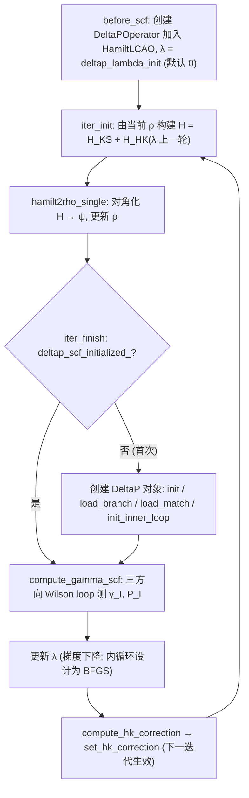

# DeltaP 算法 Notes 与批判性风险分析

> 基于 2026-07-13 至 2026-07-17 的 18 份开发记录与分析文档撰写 · 完稿日期 2026-07-18

## 一、算法概述与开发脉络

### 1.1 问题背景：为什么要约束原子极化

在现代能带理论中，固体的宏观极化由占据态 Bloch 波函数的 Berry phase 给出，是定义在模 $2\pi$ 环上的多值量；将其进一步分解为逐原子（per-atom）极化 $\gamma_I$ 需要引入原子投影权重，而展开相位允许附加任意 $2\pi k$、带交叉处单带贡献不确定（仅总和规范不变），使该分解在原则上并不唯一（见 2026-07-15-deltap-branch-uniqueness-analysis.md、2026-07-13-deltap-risk-review-evaluation.md）。若要在自洽计算中把每个原子的极化驱动到指定目标值，标准手段是约束密度泛函理论（constrained DFT）：对约束量引入 Lagrange 乘子 $\lambda_I$，以惩罚项修正 Kohn-Sham 哈密顿量。ABACUS（基于 LCAO 基组的 DFT 软件）中已有的 DeltaSpin 模块按此思想约束原子磁矩 $M_I$（其实现位于 `esolver_ks_lcao.cpp:452-585`）；DeltaP 的任务是将同一框架推广到原子极化 $\gamma_I$——约束量从可由密度矩阵直接表达的磁矩，替换为必须经由 Wilson loop 本征值相位测量的 Berry phase 量，这一替换是二者全部实现差异的根源（见 2026-07-17-deltap-stage3-innerloop-design.md、2026-07-17-deltap-workflow.md）。

### 1.2 DeltaP 的核心思想与总体框架（λ 约束 + HK 修正 + Wilson loop 测量）

DeltaP 的总体框架由三条链路构成。其一为测量链路：在沿某一方向的 k-string 上，由相邻 k 点的 LCAO 系数构造重叠矩阵 $O_j = C^\dagger(k_j)\,S(dk)\,C(k_{j+1})$，连乘得到 Wilson loop 矩阵 $W=\prod_j O_j$；对角化 $W$ 并跨 k 点追踪本征值相位得到展开相位 $\gamma^{\mathrm{unwrapped}}_n$，再按 SMO 投影权重（经 Löwdin 正交化的原子轨道投影）加权求和，得到逐原子极化 $\gamma_I=\sum_n w_{I,n}\,\gamma^{\mathrm{unwrapped}}_n$（见 2026-07-15-deltap-branch-concepts.md）。其二为耦合链路：$\lambda_I$ 作为 Lagrange 乘子经 HK 修正项进入哈密顿量，$H' = H_{\mathrm{KS}} + H_{\mathrm{HK}}$，$H_{\mathrm{HK}}=(M+M^\dagger)/2$，其中 $M$ 由 $S(dk)$、相邻 k 点系数与有效权重 $W_{\mathrm{eff}}[n]=\sum_I \lambda_I\,w_{I,n}(k_j)$ 构成，从而把逐原子约束映射到每条带；该修正滞后一个 SCF 迭代生效（见 2026-07-17-deltap-workflow.md）。其三为更新链路：每次 SCF 迭代的 `iter_finish` 中测量 $\gamma_I$ 并更新 $\lambda$（初期方案为梯度下降）。由于单次 Wilson loop 只给出 string 方向的标量相位，完整极化矢量需在 x、y、z 三个方向各做一次独立计算，即 07-13 采纳的三方向方案 A（见 2026-07-13-deltap-three-directions.md）。

### 1.3 与 DeltaSpin 的对照关系

DeltaP 在设计上逐条对应 DeltaSpin，但截至 07-17 两者的实现成熟度并不对称（见 2026-07-17-deltap-workflow.md）：

| 维度 | DeltaSpin | DeltaP（截至 07-17） |
|------|-----------|----------------------|
| 约束量 | 原子磁矩 $M_I$ | 原子极化 $\gamma_I$ |
| λ 更新位置 | `hamilt2rho_single`（内循环） | `iter_finish`（外循环） |
| λ 优化器 | BFGS（内循环） | 梯度下降（无内循环） |
| ρ 冻结 | 内循环内冻结 | 无冻结（每次迭代都更新） |
| H 修正 | `contributeHk` 中 $\lambda\times\sigma_z$ | `contributeHk` 中 $(M+M^\dagger)/2$ |
| 可观测量 | `cal_mi_lcao_wrapper` | `compute_gamma_scf` |

对照表明，DeltaP 缺失的并非约束框架本身，而是 DeltaSpin 的收敛引擎：后者的 $\lambda$ 在 `hamilt2rho_single` 内由 BFGS 内循环更新且内循环中冻结电荷密度，前者则在外循环以梯度下降更新，$\lambda$ 反馈滞后一个完整 SCF cycle（见 2026-07-17-deltap-stage3-innerloop-design.md）。更本质的差异位于可观测量层面：DeltaSpin 的 $M_I=\mathrm{Tr}(\rho\,\sigma)$ 由 $\psi\psi^\dagger$ 构成、天然规范不变，而 DeltaP 的 $\gamma_I$ 依赖 Wilson loop 本征值的排序与追踪，多出一个"eigenvalue ordering"层次——这是其全部分支一致性复杂度的来源（见 2026-07-17-deltap-innerloop-analysis.md）。07-17 的内循环设计即照搬 DeltaSpin 模式（改动约 70 行），但既有未完成实现存在 segfault，直接原因是 `hsolver_lcao_obj.solve()` 不可重入（见 2026-07-17-deltap-workflow.md）。

### 1.4 三阶段验证路线与开发时间线（07-13 → 07-17）

开发方为 DeltaP 设定了三阶段递进验证路线：先定性、再响应、后约束自洽（见 2026-07-14-deltap-three-stage-summary.md）。

| 阶段 | 目标 | 验证内容与判据 | 截至 07-17 的状态 |
|------|------|----------------|--------------------|
| Stage 1：逐原子极化分配 | 定性验证 per-atom $\gamma_I$ 合理 | BN：电负性排序 B<N、立方对称性；H₂O：O/H≈1.65（预期 1.8）、Py≈0 | ✅ 通过（07-15 确认；07-13 时记录为 ⚠️ 部分完成） |
| Stage 2：λ→γ 响应测量 | 确认 HK 修正产生系统性可测量响应 | BN 的 λ sweep，测量 $\mathrm{d}\gamma/\mathrm{d}\lambda$ | ★ 小 λ 区间通过：$\mathrm{d}\gamma/\mathrm{d}\lambda\approx 0.02$ rad/λ（冻结电荷裸响应）；λ=0.50 出现分支跳变 |
| Stage 3：内循环约束自洽收敛 | λ≠0 下 SCF 与约束同时收敛 | BN 约束计算（λ_init=0.05、step=0.01、cooldown=5） | ❌ 未成功：梯度下降发散；BFGS 内循环设计完成但实现 segfault |

三个阶段的判定口径随日期演进，须按最新文档理解。Stage 2 的响应数值在不同文档中并不一致：07-13 状态文档引用 07-12 早期数据 $\mathrm{d}\gamma/\mathrm{d}\lambda\approx 0.1$–$0.3$ per unit λ（见 2026-07-13-deltap-status-and-todo.md），07-14 三阶段总结给出 0.05–0.10 rad/λ（见 2026-07-14-deltap-three-stage-summary.md），07-15 进度记录则区分冻结电荷裸响应 ≈0.02 rad/λ 与含电荷弛豫放大的 ~0.10 rad/λ（见 2026-07-15-deltap-progress-record.md）；弛豫放大可定性解释后两者的差别，但早期 0.1–0.3 与 0.05–0.10 之间的差异未见文档说明。Stage 3 是唯一全程未通过的阶段，其失败形态从"|λ|≥0.01 时 γ 振荡"（07-13，见 2026-07-13-deltap-status-and-todo.md）演变为更明确的发散：λ 由 0.038 漂移至 0.105、γ 由 1.70 膨胀至 6.48、能量振荡振幅约 2 eV（07-15）；根因被判定为简单梯度下降 $\lambda \mathrel{+}= \mathrm{step}\times\gamma$ 在电荷-λ 耦合下不稳定，cooldown 冻结 5 步仍无法阻止（见 2026-07-15-deltap-progress-record.md）。

| 日期 | 里程碑 | 关键事件与产物 |
|------|--------|----------------|
| 07-12（及以前） | 初始实现与外部风险评审 | λ 约束 + HK 修正 + Wilson loop 链路已实现并完成 8 项早期修复；外部评审产出 18 项风险点（3 Critical/5 High/6 Medium/4 Low；rebuttal 行文中称 16 项） |
| 07-13 | 风险评审闭环与 P0/P1 修复 | rebuttal 与 evaluation 往返达成共识；当日完成 P0 匈牙利匹配与 C2/H3/H4 修复、H1/H2 验证关闭，单元测试 13/13 通过；三方向方案 A 采纳；暴露 `unkOverlap_lcao` 性能瓶颈（约 30 s/调用） |
| 07-14 | 三阶段早期总结 | Stage 1 定性通过、Stage 2 响应确认；Stage 3 因分支缓存跨方向交叉污染未测试；SCF 振荡根因分析 |
| 07-15 | 架构扩展与分支确定化 | 快速 O_kpair 路径（约 30,000× 加速）解除性能卡点；三方向 Wilson loop 落地；L1–L4 分支确定化；分支概念梳理与带交叉唯一性分析 |
| 07-17 | 内循环设计与分析 | 全流程状态与公式固化（workflow）；Stage 3 内循环设计（照搬 DeltaSpin 的 BFGS 模式，约 70 行）；H 增量更新与波函数相位分析；内循环实现 segfault 未解决 |

（各日期对应文件见 2026-07-13-deltap-status-and-todo.md、2026-07-13-deltap-progress-and-plan.md、2026-07-14-deltap-three-stage-summary.md、2026-07-15-deltap-progress-record.md、2026-07-17-deltap-stage3-innerloop-design.md、2026-07-17-deltap-innerloop-analysis.md。）

五天的开发呈现清晰的重心迁移：07-13 解决"算法是否正确"的问题——以实测数据反驳评审并闭环全部风险处置；07-14 至 07-15 解决"链路是否可运行"的问题——以 O_kpair 快速路径绕过性能卡点、以 L1–L4 分层治理分支不确定性；07-17 起全部注意力收敛于"约束能否收敛"这一唯一悬而未决的问题。还需指出，两个曾阻塞进度的问题均以架构手段处置而非根除：B16 跨运行非确定性（冻结电荷下 3 次运行 γ 不同）由匈牙利匹配、zgeev 排序与 L1–L4 等措施"理论上解决、待集成验证"，`unkOverlap_lcao` 瓶颈则被快速路径绕过、底层原因未定位（见 2026-07-13-deltap-progress-and-plan.md）。换言之，截至 07-17，测量链路（Stage 1）与耦合链路（Stage 2）已被验证至定性/半定量水平，而决定算法成败的 Stage 3 仍处于"设计完成、实现受阻"的状态，其风险构成第五章批判性分析的主题。

---

## 二、理论框架与数学形式

本章给出 DeltaP 的数学形式：约束 Hamiltonian 的构造、Wilson loop 极化测量、per-atom 分解、分支多值性及其分层治理，以及规范不变性的成立范围。记号与源码变量名保持一致，全部公式转写自开发文档原文。

### 2.1 约束 Hamiltonian 与 HK 修正项

DeltaP 在 Kohn–Sham Hamiltonian 上附加约束项（代码标识 hk_correction），以 Lagrange 乘子 $\lambda_I$ 驱动原子 $I$ 的极化趋向目标值（见 2026-07-17-deltap-workflow.md）：

$$H' = H_{KS} + H_{HK}$$

HK 修正项在每个 k 点 $k_j$ 上由 M 矩阵构造并做 Hermitian 对称化：

$$M(k_j) = \frac{i}{2}\,S(dk)\,C(k_{j+1})\,W_{\mathrm{eff}}(k_j)\,C^{\dagger}(k_j), \qquad H_{HK} = \frac{M + M^{\dagger}}{2}$$

其中 $S(dk)$ 为含 Bloch 相位的 LCAO 重叠矩阵，$C$ 为 LCAO 系数矩阵，$W_{\mathrm{eff}}$ 为对角矩阵：

$$W_{\mathrm{eff}}[n] = \sum_I \lambda_I\, w_{I_n}(k_j) = \sum_I \lambda_I \cdot \frac{\sum_{lm \in I} |D_I(k_L)[lm][n]|^2}{S_I}$$

$S_I = \mathrm{avg}_n \sum_{lm} |D_I[lm][n]|^2$ 是 per-atom preconditioner，用于归一各原子的权重尺度，避免原子间权重量级差异（见 2026-07-17-deltap-workflow.md §3.2）。

两点符号事实需如实记录。其一，实现取 half_i = (0, −0.5)，即实际 $F = -(i/2)\,w_{\mathrm{eff}} \cdot SC$，负号使 $\gamma$ 向更负方向移动；该方向经实测标定而非解析推导固定（见 2026-07-17-deltap-workflow.md §3.2）。其二，文档内部表述不一致：workflow 文档 §一总览将 Hermitian 对称化写作 $H_{HK} = M + M^{\dagger}$（无 1/2 因子），同文档 §3.2 则写 $H_{sym} = (M + M^{\dagger})/2$；两处并列于此，差异须以代码 contributeHk 的实现为准（见 2026-07-17-deltap-workflow.md）。

### 2.2 极化测量：Wilson loop、O_j 重叠矩阵、特征值展开相位

极化由 Berry phase 的离散 Wilson loop 形式测量。沿 k-string 序列 $k_0 \to k_1 \to \cdots \to k_N$，相邻 k 点的占据带重叠矩阵为：

$$O_j = C^{\dagger}(k_j)\,S(dk)\,C(k_{j+1})$$

BN 体系中占据带数 nocc = 4，$C$ 为 26×4，$S(dk)$ 为 26×26，$O_j$ 为 4×4（见 2026-07-15-deltap-branch-concepts.md §2.1）。$O_j$ 越接近单位矩阵表明 k 空间采样越密；同时 $O_j$ 依赖波函数 $C$，因而随电荷密度与 λ 改变，这是约束场反馈进入测量链路的数学通道（见 2026-07-15-deltap-branch-concepts.md §2.1）。Wilson loop 矩阵为沿 string 的连乘积 $W_j = O_0 O_1 \cdots O_j$，各 link 行列式乘积给出该 string 的总 Berry phase：$\zeta = \prod_j \det O_j$，$\arg\zeta = \sum_j \arg\det O_j$（见 2026-07-17-deltap-workflow.md §3.3）。

逐带相位通过对每个 $W_j$ 对角化（zgeev）并跨 j 追踪特征值获得。由于 zgeev 不保证特征值返回顺序，j = 0 时先按辐角排序、取 $\gamma_{\mathrm{unwrapped}}[n] = \arg\,\mathrm{evals}_0[n]$；j > 0 时用 Hungarian 算法在 cost 矩阵

$$\mathrm{cost}[m][n] = \left| \arg\!\left( \mathrm{evals}_j[n]\,/\,\mathrm{evals}_{j-1}[m] \right) \right| \quad (\mathrm{wrap}\ \pm\pi)$$

上求全局最优匹配，再向展开相位累加相位差（见 2026-07-17-deltap-workflow.md §3.5、2026-07-15-deltap-branch-concepts.md §2.2）。展开相位消除了主值边界 ±π 处的 2π 跳变，是 per-atom 分解的输入。每条 string 给出的标量 γ 只沿 string 方向敏感，因此三方向极化矢量需在 x、y、z 三个方向各构造一次 k-string（方案 A，工程取舍见第三章）（见 2026-07-13-deltap-three-directions.md）。

### 2.3 Per-atom 分解：SMO 投影、Löwdin 正交化与权重 w_I_n

per-atom 极化定义为逐带展开相位的加权和：

$$\gamma_I = \sum_n w_{I_n}\,\gamma_{\mathrm{unwrapped}}[n], \qquad w_{I_n} = \sum_{lm \in I} \left| \langle \alpha^I_{lm} \,|\, \psi_n \rangle \right|^2$$

其中 $\alpha^I_{lm}$ 为归属原子 $I$ 的 SMO 局域轨道投影基（原文档通篇使用缩写 SMO，未给出全称展开，本章沿用）。实现上先以 $D_I(k_0)$ 右乘最终 Wilson loop 的本征矢矩阵得 proj，再左乘 $S^{-1/2}$ 做 Löwdin 正交化得 tilde_proj，$w_{I_n}$ 即 tilde_proj 对原子 $I$ 基函数的模方和（见 2026-07-17-deltap-workflow.md §3.3 阶段 4）。

完备性上，Löwdin 理想情形 $\sum_I w_{I_n} = 1$；实际 SMO 基组不完备，权重和偏离 1。文档对偏离方向的记录不一致：branch-concepts 文档写 $\sum_I w_{I_n} < 1$（见 2026-07-15-deltap-branch-concepts.md §2.5），而 Stage 1 实测 BN 中 B、N 的 w_sum 分别为 1.45 与 1.71，即大于 1（见 2026-07-13-deltap-stage1-bn-h2o.md）。两处并列呈现；共同事实是权重和非恒等于 1，该不完备性正是 2.5 节 rescaling 的修正对象。此外，不同 string 经过不同 k 点，SMO 投影权重不同，per-atom γ 跨 string 变化通常达 10–30%（见 2026-07-15-deltap-branch-concepts.md §2.4）。

### 2.4 分支选择的多值性：2π 不唯一性与 L0–L4 分层治理

Berry phase 只定义在模 2π 意义下：每个带的展开相位可独立附加 $2\pi$ 的整数倍，per-atom 极化因此可相差 $2\pi\, w_{I_n}$。分支选择在参考值 prev 邻近锁定连续的一支：若 $|g - \mathrm{prev}| < \pi$ 则不校正，否则对每个带搜索 $\pm 2\pi \times w_{I_n}$ 偏移的候选，取 $|\mathrm{candidate} - \mathrm{prev}|$ 最小者（见 2026-07-15-deltap-branch-concepts.md §2.7）。多值性沿计算链路在五个层次上表现为不确定性，开发文档将其组织为 L0–L4 分层治理模型：

| 层级 | 治理对象 | 失效条件 | 状态（截至 2026-07-15） |
|:---:|---|---|---|
| L0 | 带交叉（per k-point pair） | 两带特征值模长差 → 0 | 无检测，待实现 |
| L1 | 特征值匹配顺序（per k-pair） | Hungarian cost 矩阵二义 | 匹配确定但跨 λ 不一致，未冻结 |
| L2 | zeta scale 参考值（per alpha） | 各 string 展开相位和不同 | 已修复：ref_gamma_unw_sum 固定 |
| L3 | per-atom 分支参考（per alpha） | prev_gamma 缺失或错误 | 已修复：prev_gamma = 0 或 W_prev_3d |
| L4 | 跨 SCF 分支持久化 | W_prev_ 跨方向污染 | 已修复：W_prev_3d 按 Vector3 存储 |

（层级定义与状态见 2026-07-15-deltap-branch-concepts.md §三；L0 失效条件按该表原文为模长差口径，branch-concepts 正文另有相位差口径；L1 冻结设施 deltap_match.dat 见 2026-07-17-deltap-workflow.md §2.1）

该模型的治理逻辑是将各层多值性逐层"冻结"为可持久化的状态：L2 以第一条 string 的展开相位和作为全体公共参考，L3/L4 以 prev_gamma 与跨 SCF 保存的 W_prev_3d 锚定分支参考。三项修复使同一 run 内跨 string 的 γ 标准差从 1.6 rad 降至约 3×10⁻³（见 2026-07-15-deltap-branch-concepts.md §五）。剩余开口集中于 L1 与 L0：Hungarian 匹配每次调用重算，λ = 0 与 λ = 0.05 下匹配排列不同，被定位为 Stage 2 λ sweep 振荡的根因（见 2026-07-15-deltap-branch-concepts.md §4.3）；L0 检测完全缺失，当前仅因 BN 主导带（带 2 贡献约 93% 极化且与其他带孤立）不交叉而未暴露后果（见 2026-07-15-deltap-branch-concepts.md §2.2.3）。

### 2.5 Zeta rescaling 与 C2 数学错误（方案 B 修正）

为补偿权重不完备，实现对 per-atom γ 做 rescaling：$\gamma_I^{corr} = \gamma_I^{raw} \times scale$，目标是使 $\sum_I \gamma_I$ 回到展开相位和的量级。原实现取

$$scale = \frac{\arg\det W}{\sum_I \gamma_I^{raw}}$$

被外部风险评审判定为 Critical 级数学错误（编号 C2，评审双方维持 Critical 共识）（见 2026-07-13-deltap-risk-review-evaluation.md）。错误机理：$\arg\det W$ 是主值，取值于 $(-\pi, \pi]$，而展开相位和 $\sum_n \gamma_{\mathrm{unwrapped}}[n]$ 可附加 $2\pi k$（k 为整数）；当分母经加权和继承了非零分支时，分子分母相差 $2\pi k$，scale 系统性偏离 1，全部 per-atom γ 被错误缩放（见 2026-07-13-deltap-risk-review-rebuttal.md、2026-07-13-deltap-status-and-todo.md）。三个处置方案的对照如下：

| 方案 | scale 取法 | 评审处置 | 理由 |
|---|---|---|---|
| 原实现 | $\arg\det W \,/\, \sum_I \gamma_I^{raw}$ | 判为 Critical 错误 | 分子为主值，与分母可差 $2\pi k$ |
| 方案 A | 删除 rescaling | 否决 | SMO 不完备时 rescaling 有合法用途 |
| 方案 B | $\sum_n \gamma_{\mathrm{unwrapped}}[n] \,/\, \sum_I \gamma_I^{raw}$ | 采纳并实施 | 分子分母取自同一展开链路，分支一致 |

（见 2026-07-13-deltap-risk-review-evaluation.md、2026-07-13-deltap-risk-review-rebuttal.md）

方案 B 的修正要点不是改变 rescaling 的函数形式，而是统一分子与分母的分支：分子改用与分母同源的展开相位和，任一分支选择产生的 $2\pi k$ 在分子分母中同步出现，权重完备时比值恒为 1，偏离 1 的部分只反映 SMO 不完备度（实测 scale 约 0.9–1.1，见 2026-07-15-deltap-branch-concepts.md §2.5）。方案 B 还与 L2 修复耦合：所有 string 共用第一条 string 的展开相位和 ref_gamma_unw_sum 计算 scale，消除了修复前各 string scale 不一致导致的 per-atom γ 跨 string 跳变（BRANCH INCONSISTENT）（见 2026-07-15-deltap-branch-concepts.md §2.5）。

### 2.6 规范不变性论证与 per-atom 分解的任意性

广义本征问题 $H\psi = \varepsilon S \psi$ 的本征矢可乘任意相位 $e^{i\theta_n}$，且不同对角化之间相位不可控（见 2026-07-17-deltap-innerloop-analysis.md §2.1）。在该相位下 O_j 左右各乘一个对角相位矩阵：

$$O'_j[n,m] = e^{-i\theta_n}\, O_j[n,m]\, e^{i\theta_m}$$

而闭合 Wilson loop 的行列式规范不变：$\det W = \prod_j \det O_j$ 中相邻 link 引入的相位两两抵消，因此总极化（由 $\arg\det W$ 决定的量）是良定义可观测量（见 2026-07-17-deltap-innerloop-analysis.md §2.2）。

不变性在另外两个层面不成立。其一，单带相位层面：$W_j$ 特征值的辐角及其排序受 ψ 任意相位影响，首次对角化的 arg 排序与 Hungarian cost 矩阵均依赖该排序，单带 $\gamma_{\mathrm{unwrapped}}[n]$ 不是规范不变量；仅在带交叉处，两带相位和 $\arg\,\mathrm{evals}[n] + \arg\,\mathrm{evals}[m]$ 保持不变，单带分量则丧失意义（见 2026-07-17-deltap-innerloop-analysis.md §2.3、2026-07-15-deltap-branch-uniqueness-analysis.md §1.2）。其二，per-atom 层面：$w_{I_n}$ 依赖 SMO 投影基、Löwdin 正交化与"哪些基函数归属原子 I"的人为分区，不同分解给出不同的 $\gamma_I$；当两带交叉且 $w_{I_n} \neq w_{I_m}$ 时，交换两带使 $\gamma_I$ 跳变而总和不变（见 2026-07-15-deltap-branch-concepts.md §2.4）。Stage 1 的 H₂O 测试提供了分区任意性的具体例证：两个 H 被 SMO 投影归为同一有效原子（nat = 2），per-hydrogen 贡献需事后均分得到（见 2026-07-13-deltap-stage1-bn-h2o.md）。因此数学上严格成立的表述是：$P_{total} = \sum_I P_I$ 满足求和规则且规范不变，而单个 $\gamma_I$ 的数值承载分解方案的选择。这与 DeltaSpin 形成对照——后者约束量 $M_I = \mathrm{Tr}(\rho_I \sigma)$ 中 ψ 与 ψ† 成对出现、相位自动抵消，可观测量天然规范不变；DeltaP 因需追踪逐带相位而多出"eigenvalue ordering"这一层次（见 2026-07-17-deltap-innerloop-analysis.md §2.6）。

---

## 三、实现架构与工作流

本章记录 DeltaP 在 ABACUS LCAO 模式下的工程实现：SCF 循环的四个挂接点、三层状态分类与内存生命周期、三方向极化的方案取舍、仿 DeltaSpin 的内循环设计，以及实现过程中暴露的两项工程难点。数学框架的推导见第二章，此处仅描述代码层面的结构与数据流。

### 3.1 与 ABACUS SCF 循环的集成

DeltaP 通过四个挂接点嵌入 ABACUS 的 SCF 主循环。`before_scf` 阶段创建 `DeltaPOperator` 并加入 `HamiltLCAO`，Lagrange 乘子 λ 初始化为 `deltap_lambda_init`（默认 0），此阶段不创建 DeltaP 对象；`iter_init` 用当前电荷密度 ρ 构建 Hamiltonian，iter = 1 时因 λ = 0 而不含 HK 修正；`hamilt2rho_single` 执行对角化并更新 ρ；DeltaP 对象延迟到首次 `iter_finish` 才创建，一次性完成 `build_orb_onsite`、`r_overlap_scf_` 分配、`dp->init`（保存 gd、kv 指针，SMO 与 k-string 延迟到首次极化计算）、`load_branch`（读 `deltap_branch.dat`）、`load_match`（读 `deltap_match.dat`）、`deltap_target_` 初始化与 `init_inner_loop`，随后执行 `compute_gamma_scf` 测极化、更新 λ、`compute_hk_correction` 构建 HK 修正并由 `set_hk_correction` 写入算子（见 2026-07-17-deltap-workflow.md）。`berry_ovl_scf_` 路径已废弃，由快速 O_kpair 路径替代（见 2026-07-17-deltap-workflow.md）。

一个关键的时序事实是 HK 修正总是滞后一个 SCF 迭代：iter $N$ 的 Hamiltonian 为 $H_N = H_{\mathrm{KS}} + H_{\mathrm{HK}}(\lambda_{N-1})$，即当前迭代测得的 γ 是在上一轮 λ 的 HK 修正下获得的（见 2026-07-17-deltap-workflow.md）。这一滞后是旧外循环方案收敛困难的三条根因之一（另两条为 λ 更新破坏 Broyden mixing 历史且 cooldown 5 步不足以重收敛、缺少内循环机制）（见 2026-07-17-deltap-stage3-innerloop-design.md）。

### 3.2 状态管理：持久态 / 半持久态 / 临时态与内存生命周期

工作流文档将 DeltaP 的全部物理量划分为三层状态（见 2026-07-17-deltap-workflow.md）。下表按生命周期与更新时机合并列出代表成员。

| 层级 | 代表成员 | 生命周期与清除条件 | 初始化 / 更新时机 |
|---|---|---|---|
| 持久态（跨 SCF 迭代） | λ（`double[nat]`）、`hk_correction_`、`W_prev_3d`、`saved_matches_`、`results_`、`scf_initialized_` / `deltap_scf_initialized_` 门闩 | 整个 SCF 过程存活；cooldown 期间 λ 冻结 | λ 由 `before_scf` 初始化、`iter_finish` 更新；`W_prev_3d`、`saved_matches_` 经 `load_branch` / `load_match` 从磁盘读入 |
| 半持久态（同一 iter 内跨 string / 方向） | `S_dk_`、`kstring_data_`（约 100 KB）、`prev_gamma`、`gamma_accum`、`n_strings_processed` | alpha 方向切换时 `S_dk_.clear()`；后三者为 alpha 循环局部、每方向重新初始化 | 每 alpha 的 `setup_kstring` 后填充；gamma 累加器每方向独立（跨 alpha 污染修复） |
| 临时态（per k-string） | `psi_k_ptrs`、`S_k` / `D_I`、`O_kpair`、`SC`、`W_mat`、`cost`、`evals_j` / `evals_prev`、`gamma_unwrapped`、`w_In_matrix`、`gamma_I_per_atom` | istring / j 循环局部，栈分配自动释放 | 每条 string 的 O_kpair、Wilson loop 与 per-atom 投影阶段 |

三层划分的工程意义在于明确了每类状态的一致性问题归属。持久态承担跨迭代与跨运行的确定性：`W_prev_3d`（`Vector3[nat]`，修复了此前只存 z 方向的污染）与 `saved_matches_`（`int[alpha][string][j][n]`）分别通过 `deltap_branch.dat` 与 `deltap_match.dat` 两个文件落盘，在每次 `compute_wannier_polarization` 结束时保存（见 2026-07-17-deltap-workflow.md）。半持久态的 alpha 循环局部化对应「跨 alpha 的 `gamma_accum` 共享导致 P 污染」的修复，三个方向各自独立累加再求平均（见 2026-07-17-deltap-workflow.md）。内存生命周期上，DeltaP 对象在 iter = 1 的 `iter_finish` 创建，SMO 初始化发生在首次极化计算，`k_index_`、`nppstr_`、`total_string_` 在每次 alpha 切换时被 `setup_kstring` 覆盖写入（见 2026-07-17-deltap-workflow.md）。内存量级上，方案 A 在 BN（NBASIS = 26，nocc = 4）上合计约 36 KB，其中 `S_dk_` 三方向占 33 KB；大体系（100 原子、500 带、20 k 点/string）外推约 50 MB（见 2026-07-13-deltap-scheme-b-evaluation.md）。

### 3.3 三方向 Wilson loop（方案 A）与方案 B（A_nk 积分）的取舍

Wilson loop 计算的是沿 k-string 方向的 Berry phase 积分，每条 string 只给出标量 γ，无法由 z 方向的 γ 推出 $P_x$ 或 $P_y$，必须在三个方向各跑一次（见 2026-07-13-deltap-three-directions.md）。方案 A 在 `compute_wannier_polarization` 外层加 `for alpha=0..2` 循环，每次重设 `gdir_`、重调 `setup_kstring`，复用同一组 ψ 与 `S_k` / `D_I`；下游 `alpha_idx = gdir_ − 1` 的五处硬编码同步修改（见 2026-07-13-deltap-three-directions.md）。方案 B 直接对已存的三方向 Berry connection $A_{nk}$ 逐 k 点求和，一次积分即得三方向，无需对角化与分支选择（见 2026-07-13-deltap-scheme-b-evaluation.md）。两方案的取舍依据如下表（数据均见 2026-07-13-deltap-scheme-b-evaluation.md）。

| 维度 | 方案 A（三方向 Wilson loop） | 方案 B（$A_{nk}$ 直接积分） |
|---|---|---|
| 规范依赖性 | 规范不变（只依赖 det $W$） | gauge 敏感，依赖 gauge_fix 质量（评估定为「致命」） |
| 分支处理 | 以 $O(\mathrm{nocc}^3)$ 对角化 + Hungarian 匹配自动处理 2π 分支 | 不经过 2π unwrapping，无分支选择 |
| BN 2×2×2 实测 $P_{\mathrm{total}}$ | 约 $1.2\times10^{-2}$ | 约 $3\times10^{-6}$（差约 4000 倍） |
| 内存（BN / 大体系外推） | 约 36 KB / 约 50 MB | 约 100 KB / 约 500 MB（约 10 倍） |
| 工程定位 | 主力方法，已实现 | 降级为交叉验证工具，约 3 工作日，建议 Stage 3 通过后实施 |

实测 4000 倍差距的归因值得记录：k 点采样差异（Wilson 平均 4 strings × 3 kpts = 12 点，$A_{nk}$ 当时只用 string 0 的 3 点）只能解释约 4 倍，根因被定位在归一化公式与积分范围——Wilson 用 `spin × R/(2πV)` 而 $A_{nk}$ 路径用 `−R/(2πV) × dk`，两者并非同一物理量（见 2026-07-13-deltap-scheme-b-evaluation.md）。方案 B 的 gauge 敏感性构成实质性风险：`gauge_fix_smo_anchored` 已发现 H4 bug，一旦规范固定出错则 $A_{nk}$ 全错，而 Wilson 路径不受影响；其免分支选择、逐 k 点诊断的价值因此被限定为「Wilson 出现异常（分支不一致、NaN）时的独立检查」（见 2026-07-13-deltap-scheme-b-evaluation.md）。与方案 A 配套的性能前提是快速 O_kpair 路径：以 `S_dk_` 加手写 GEMM（$O = C^\dagger(k_L)\, S_{dk}\, C(k_R)$，两次 GEMM）替代 `unkOverlap_lcao`，记录为约 30{,}000 倍加速（见 2026-07-15-deltap-progress-record.md；路径状态见 2026-07-17-deltap-workflow.md）。长期目标是废弃 `gdir` 参数，自动输出 $(P_x, P_y, P_z)$ 矢量（见 2026-07-13-deltap-three-directions.md）。

### 3.4 内循环设计（仿 DeltaSpin BFGS 内循环）：H 增量更新机制（dp_hr_done）

内循环设计照搬 DeltaSpin 在 `hamilt2rho_single`（`esolver_ks_lcao.cpp:452-585`）中的模式：`bfgs.start_outer(lambda_init)` 后，内循环每步由 `bfgs.step(residual)` 给出试探 λ，`set_lambda` + `update_lambda` 触发 H 更新（不动电荷密度），重新对角化得 ψ′，`compute_gamma_scf` 测 γ，残差取 `residual = target − γ` 交回 `bfgs.accept_trial`；循环结束后 `set_lambda(optimized_λ)` 并置 `skip_solve = true`，随后进入正常的电荷密度更新（见 2026-07-17-deltap-stage3-innerloop-design.md）。所需基础设施（FletcherReevesCG 优化器、`compute_gamma_scf`、`compute_hk_correction`、`set_lambda`、`update_lambda`、`contributeHk`、快速 O_kpair 路径）均已就位，新增实现量估计约 70 行（内循环块约 +60 行、移除旧梯度下降 −20 行、BFGS 初始化约 +10 行）（见 2026-07-17-deltap-stage3-innerloop-design.md）。

H 更新不采用全量重建，而是复用算子内置的 `dp_hr_done` 增量状态机（与 `dspin_lcao.cpp` 同模式）：`set_lambda(λ_new)` 仅置 `lambda_ = λ_new`、`dp_hr_done = false`，刻意不写 `lambda_save_` 以保留旧值；下次对角化时 `contributeHR()` 自动分支——全量未建则全量重建（SCF iter 起点），否则取差分

$$
\mathrm{HR} \mathrel{+}= \mathrm{d}\lambda \times \tau \times \mathrm{pre\_hr}, \qquad \mathrm{d}\lambda = \lambda_{\text{new}} - \lambda_{\text{save}}
$$

HR 不清零、KS 部分保留，只追加差分项，随后 `lambda_save_` 同步并置位 `dp_hr_done`（见 2026-07-17-deltap-innerloop-analysis.md）。完整链路为 `set_lambda` → `compute_hk_correction` → `set_hk_correction` → `hamilt->updateHk(ik)`（`init(ik)` 内 `contributeHR` 追加差分、`contributeHk` 加 k 依赖的 HK 修正、`base::contributeHk` 做 HR fold）→ `hsolver.solve`（见 2026-07-17-deltap-innerloop-analysis.md）。与 DeltaSpin 对照，增量 flag 分别为 `sc_hr_done` 与 `dp_hr_done`，增量公式分别为 $\mathrm{d}\lambda \times \mathrm{coeff} \times \mathrm{pre\_hr}$ 与 $\mathrm{d}\lambda \times \tau \times \mathrm{pre\_hr}$，DeltaP 额外携带 k 依赖项（见 2026-07-17-deltap-innerloop-analysis.md）。需注意同日的两份文档存在一次设计修正：较早的设计文档在内循环伪代码中写 `hamiltLCAO->refresh_H()` 并将「是否只重建 HK 部分」列为待验证风险，较晚的分析文档结论为增量机制已存在、无需全量 `refresh()`，前者未同步更新（见 2026-07-17-deltap-stage3-innerloop-design.md；2026-07-17-deltap-innerloop-analysis.md）。

### 3.5 工程难点：hsolver 不可重入 segfault、相位不确定性

`esolver_ks_lcao.cpp:605-680` 已有一段未完成的内循环实现，运行时 segfault；分析排除了 H 更新路径后，将根因锁定为 `hsolver_lcao_obj.solve()` 不可重入，并给出三个候选假设及对应处置：（1）`compute_gamma_scf` 调用了 `psi->fix_k()` 改变 ψ 内部状态，而后续 `solve()` 假设 ψ 处于特定状态——solve 前以 `psi->fix_k(0)` 重置；（2）`HSolverLCAO::solve()` 可能假设首次调用时 `pelec->f_en.eband = 0`，第二次调用时 eband 非零——solve 前重置 `eband`（及 `demet`）为零；（3）ψ 内部数组在上次 solve 后被破坏。建议的调试顺序为：先以内循环 `nscf = 1` 加 eband/demet 清零验证；若仍 segfault，则每次内循环新建 `HSolverLCAO` 对象；若新对象可解决，即确认是 solver 对象状态重用问题（见 2026-07-17-deltap-innerloop-analysis.md）。截至工作流文档定稿，三个候选根因尚未最终确认（见 2026-07-17-deltap-innerloop-analysis.md）。

第二项难点是波函数相位不确定性。广义本征值问题 $H\psi = \varepsilon S\psi$ 的本征矢可乘任意相位 $e^{i\theta_n}$，LAPACK 单次对角化内部归一化一致，但不同对角化之间相位不可控（见 2026-07-17-deltap-innerloop-analysis.md）。相位使重叠矩阵按 $O'_j[n,m] = e^{-i\theta_n}\, O_j[n,m]\, e^{i\theta_m}$ 变换，闭合 Wilson loop 的行列式 $\det(W_{\mathrm{final}}) = \prod_j \det(O_j)$ 因相邻 link 的相位抵消而规范不变；问题只存在于单个 k-point pair 的特征值追踪层——首次对角化按 arg 排序时近邻特征值可能交换、后续 Hungarian 的 cost 矩阵亦受相位排列影响（见 2026-07-17-deltap-innerloop-analysis.md）。这对内循环构成明确的前置条件：内循环每步 solve 产生新 ψ 与新相位，若 L1 匹配已冻结（`deltap_match.dat` 加载），复用相同 `match_to[]` 可保证 `gamma_unwrapped` 一致；否则 Hungarian 重算可能给出不同匹配，导致 γ 在 residual 评估中跳变（见 2026-07-17-deltap-innerloop-analysis.md）。作为对照，DeltaSpin 不受此问题影响：其可观测量 $M = \mathrm{Tr}(\rho\sigma)$ 由密度矩阵 $D = \sum_n f_n \psi_n \psi_n^\dagger$ 给出，$\psi\psi^\dagger$ 消除相位，天然规范不变、无需特征值匹配——DeltaP 比 DeltaSpin 多出一个「eigenvalue ordering」层次，这是两者工程复杂度差异的根源（见 2026-07-17-deltap-innerloop-analysis.md）。

---

## 四、测试验证与问题修复历程

本章按三阶段路线重建 2026-07-12 至 07-15 的测试证据与修复记录；「已验证」仅指有运行输出或代码记录直接支持的论断，「未验证」指仅有方案或推断而无通过记录的部分。

### 4.1 Stage 1：BN / H₂O 定性验证（电负性排序、对称性、O/H 比）

Stage 1 的判据为 per-atom 极化分配的定性正确性：电负性排序（BN 中 B<N，H₂O 中 H<O）、对称性（立方 BN 应 $P_x=P_y=P_z$；H₂O 全原子位于 xz 平面，应有 $P_y\approx 0$）、跨 string 分支一致性。测试条件为 scf_nmax=3、scf_thr=1e-8、mixing_beta=0.4、2×2×2 k-mesh、无约束（见 2026-07-13-deltap-stage1-bn-h2o.md）。

| 体系 | iter | $P_x$ (a.u.) | $P_y$ (a.u.) | $P_z$ (a.u.) | 对称性判定 |
|:---:|:---:|:---:|:---:|:---:|:---|
| BN | 1 | −9.71×10⁻³ | −7.42×10⁻³ | −1.23×10⁻² | ❌ 三分量互不相等 |
| BN | 2 | 1.246×10⁻² | 1.246×10⁻² | 1.246×10⁻² | ✅ 精确相等 |
| BN | 3 | −1.199×10⁻² | −1.199×10⁻² | −1.344×10⁻² | ❌ $P_z$ 偏离约 12% |
| H₂O | 1 | 1.800×10⁻² | 1.800×10⁻² | 1.571×10⁻² | ❌ $P_y$ 被虚假等化 |
| H₂O | 2 | 1.246×10⁻² | 2.713×10⁻³ | 1.246×10⁻² | ✅ $P_y\ll P_x=P_z$ |
| H₂O | 3 | 1.687×10⁻² | 1.687×10⁻² | 1.687×10⁻² | ❌ $P_y$ 再次被等化 |

（数值见 2026-07-13-deltap-stage1-bn-h2o.md；与 2026-07-14-deltap-three-stage-summary.md 一致，后者 H₂O 行保留三位有效数字）

表中核心事实是「iter 2 通过」与「3 轮不收敛」并存：两体系均跑满 3 轮未达 scf_thr=1e-8，iter 3 即偏离判据。两点边界须同时记录：其一，iter 2 的「完美相等」部分是假象——累加器共享使三分量成为同一次累加的不同快照（见 4.3 节 Bug 1）；其二，其物理正确性另有独立证据——旋转等价性测试中三次单方向独立计算（互为全等旋转）在 iter 2 给出 8 位有效数字全等的 $P=+1.185×10⁻²$，逐原子 γ（B=1.1166、N=1.3406）三方向一致，σ≤1.3×10⁻³ rad（见 2026-07-13-deltap-rotation-test.md）。「已验证」范围由此限定为：接近自洽时单方向测量链给出对称性正确的定性分配。

逐原子分解方面，BN 的 γ(sel) 为 B=1.117（45%）、N=1.341（55%），排序 B<N 符合电负性预期；H₂O 的 O 为 1.58、两个 H 合计 1.91（单个 0.955），O/H 比 1.65，较预期 1.8 偏低约 8%，原文归因于 SMO 权重和不为 1 的基组不完备性（见 2026-07-13-deltap-stage1-bn-h2o.md）。分支确定化修复后，BN 于 iter 21 SCF 收敛，逐原子 B=1.53、N=1.85；H₂O 因大晶胞对角化过慢仅 9 轮未收敛，O/H≈1.65 与 $P_y\approx0$ 仍成立（见 2026-07-15-deltap-progress-record.md）。

### 4.2 Stage 2：λ→γ 响应（dγ/dλ 数据）与 λ sweep 振荡

Stage 2 检验 HK 修正势是否产生可测量的极化响应。可用数据来自早期单方向 Wilson Loop 代码：BN、mixing_beta=0（冻结电荷）、3×3×3=27 k 点、symmetry=-1、deltap_lambda_step=0.0（各 λ 独立从零初始电荷起算）（见 2026-07-13-deltap-test-data.md）。

| λ | γ₀ (rad) | Δγ = γ(λ)−γ(0) | dγ/dλ（分段差分） |
|:---:|:---:|:---:|:---:|
| 0.00 | −0.0842 | — | — |
| 0.05 | −0.0791 | +0.0051 | 0.102 |
| 0.10 | −0.0738 | +0.0104 | 0.104 |
| 1.00 | −0.0325 | +0.0517 | 0.052 |
| 5.00 | −0.3866 | −0.3024 | −0.077 |

（见 2026-07-13-deltap-test-data.md；同一组数据转载于 2026-07-14-deltap-three-stage-summary.md）

λ<1 区间 dγ/dλ 分段值为 0.102、0.104、0.052（约 0.05–0.10 rad/λ），γ 随 λ 单调增大且方向与约束力符号一致，构成「HK 修正产生系统性可测响应」的直接证据；λ=5.0 处反号为 −0.077，原文定性为 HK 线性化近似在大 λ 下的偏离而非代码错误（见 2026-07-13-deltap-test-data.md）。响应幅度口径在文档间不一致，须并列呈现：rebuttal 记 dγ/dλ≈0.1–0.3 per unit λ（见 2026-07-13-deltap-risk-review-rebuttal.md）；07-15 冻结电荷加 L1 匹配冻结下 λ=0/0.05/0.10 的 g0 为 −1.161/−1.161/−1.163，裸响应仅 dγ/dλ≈0.02 rad/λ，早期 mixing_beta>0 的约 0.10 rad/λ 则含电荷弛豫放大（见 2026-07-15-deltap-progress-record.md）。弛豫放大可解释 0.02 与 0.10 之差，但 0.1–0.3 与 0.05–0.10 的差异未获解释。

三方向代码下的 λ sweep 则完全失效：λ=0.00 时 $P_z=−1.23×10⁻²$，λ=0.05 时 $P_z=+1.54×10⁻²$，符号跳变、无 dγ/dλ 趋势（见 2026-07-14-deltap-scf-oscillation-analysis.md）；修复后的 07-15 记录中，λ=0.50 仍出现 g0 由 −1.161 跳至 +1.706 的分支跳变，仅 λ≤0.10 稳定（见 2026-07-15-deltap-progress-record.md）。

### 4.3 SCF 振荡根因分析链：三个 bug（累加器共享、跨 SCF 污染、首 string 锚定）

2026-07-14 的根因分析将三方向代码（方案 A）的 Stage 1/2 失败归因为三个代码 bug（见 2026-07-14-deltap-scf-oscillation-analysis.md）。

Bug 1（P0，累加器跨方向共享）：`gamma_accum`、`n_strings_processed` 声明在 alpha 循环外被三方向共享，alpha=0 的输出只含 x-strings（近似 $P_x$），alpha=1 实为 $(P_x+P_y)/2$，alpha=2 实为 $(P_x+P_y+P_z)/3$。这直接解释了 H₂O 的 $P_y$ 等化与 iter 2「过于完美」的相等——三个分量并非独立测量。

Bug 2（P0，分支状态跨 SCF 污染）：持久化到 `deltap_branch.dat` 的 `W_prev_` 只保存最后方向（alpha=2）的 γ_z，下一轮 SCF 的 alpha=0 却用它作 x 方向分支参考，不同方向的 2π 分支被错误互锁；γ 波动超过 π 即触发错误校正，表现为迭代间符号跳变（+1.25×10⁻² ↔ −1.20×10⁻²），$P_\mathrm{total}$ 在 ±1.2×10⁻² 间振荡。

Bug 3（P1，首 string 锚定缺失）：每个方向的 `prev_gamma` 初始化为 NaN，第一条 string 的自由选择决定整个方向的走向：实测 alpha=0 首条 string raw γ≈+0.13 被锚到 +1.67，alpha=1 首条 raw γ≈−0.04 被锚到 −1.15，跨方向符号不一致经累加混合产生振荡。三 bug 叠加同样解释 Stage 2 失效：即使冻结电荷，分支缓存污染与随机锚定也使 γ 随 λ 无规律振荡。

修复方案为：累加器隔离（P0，约 10 行）、`W_prev_` 改 Vector3 按 (iat, alpha) 存取（P0，约 20 行）、首 string 锚定（P1，约 15 行），合计约 45 行、估计 1–2 小时，另设 Stage 2「冻结分支」模式（P2，约 30 行）（见 2026-07-14-deltap-scf-oscillation-analysis.md）；`W_prev_3d` 与 prev_gamma=0.0 已实施（见 2026-07-15-deltap-progress-record.md）。同一文档还指出独立于代码的机制：mixing_beta>0 时电荷与 λ 构成二维耦合动力学，时间尺度不匹配即可振荡；稀疏 k 点下 Hungarian 匹配 cost 对微扰敏感，建议 ≥3×3×3 网格与 close-match guard（P3，未实施）（见 2026-07-14-deltap-scf-oscillation-analysis.md）。

### 4.4 B16 非确定性与确定性保障（zgeev 排序、Hungarian、match 冻结）

B16 即「冻结电荷下 γ 跨运行不同」。其决定性实验为：mixing_beta=0 + HR 延迟 + HK 缓存，使哈密顿量与波函数每轮全同，γ 逻辑上必须全同；在输入、二进制、电荷密度相同且单进程运行的条件下，三次运行 γ₀ 分别为 +0.098、−0.062、−0.098（见 2026-07-13-deltap-test-data.md）。符号不一致排除了物理原因，非确定性被定位到 Wilson loop 本征值计算内部。HK 缓存对照实验进一步显示混沌放大：两次运行 iter=15 的 γ₀ 仅差 0.0031 rad，iter=30 被电荷密度演化放大到 0.49 rad（见 2026-07-13-deltap-test-data.md）。

评审方提出四个候选根因：zgeev 不保证特征值返回顺序；编译器浮点重排（-O3/-ffast-math）使矩阵连乘舍入误差不同；Newton–Schulz 迭代的浮点非结合性（10⁻¹⁵ 量级差异可跨越匹配阈值）；MPI_Allreduce 归约顺序依赖进程调度（见 2026-07-13-deltap-risk-review-evaluation.md）；status-and-todo 补充第五项「贪心匹配对微量差异敏感」（见 2026-07-13-deltap-status-and-todo.md）。深入分析进一步收窄性质：W 矩阵本身确定，非确定性来自本征值分解与分支选择——两本征值相位差小于 10⁻¹⁴ 时排序不稳定，匹配在简并附近走向不同配对，per-atom γ 跳变 2πw_n^I（见 2026-07-13-deltap-branch-selection-deep-dive.json）。

确定性保障按四层防御设计：Layer 1 以 zgees（Schur 分解）或字典序排序加相位固定替代 zgeev 输出；Layer 2 匈牙利算法替换贪心匹配；Layer 3 跨 string 共用参考分支；Layer 4 跨 SCF 迭代按方向持久化（见 2026-07-13-deltap-branch-selection-deep-dive.json）。实施记录为：zgeev 输出按 arg 排序（P4）、匈牙利（Kuhn–Munkres，O(n³)）替换贪心、NS 收敛检查加 SVD fallback、L1 以 `deltap_match.dat` 保存/加载匹配、L2 以 `ref_gamma_unw_sum` 固定跨 string zeta scale、L3 以 prev_gamma=0 加 `W_prev_3d` 锚定、L4 跨迭代持久化（见 2026-07-15-deltap-progress-record.md；2026-07-13-deltap-status-and-todo.md）。边界必须标明：验收标准为冻结电荷三次运行 max|Δγ|<10⁻¹⁰，截至 07-15 无通过记录，文档原话为「理论上已解决，待 SCF 集成测试验证」（见 2026-07-13-deltap-progress-and-plan.md）。

### 4.5 外部风险评审与作者 rebuttal 的共识（18 项风险逐类处置）

2026-07-12 的外部评审产出风险清单 18 项（3 Critical、5 High、6 Medium、4 Low；rebuttal 称「16 项」，evaluation 称「18 项」，并列存照）。作者于 07-13 逐条 rebuttal，评审方同日回应，最终处置如下表（见 2026-07-13-deltap-risk-review-rebuttal.md；2026-07-13-deltap-risk-review-evaluation.md）。

| 处置类别 | 涉及项 | 关键依据 |
|:---|:---|:---|
| 维持 Critical（1 项） | C2 zeta rescaling | 数学推导双方一致；采用方案 B（Σγ_unwrapped/Σγ_raw） |
| 降级（3 项） | C1 Critical→High；C3 Critical→Medium；H5 High→Low | C1：实测 dγ/dλ 响应证明 S_dk 工作，3×3×3 网格上误差约 0.03 rad；C3：与电荷 mixing 同质、实测 Δλ=0.1 仅改 γ 约 0.01 rad；H5：fmod 是合理的 2π 约化 |
| 待验证后关闭（2 项） | H1、H2 | H1：max_asym=6.7×10⁻¹⁷<10⁻¹⁵；H2：双重共轭抵消、|D_I|² 不受影响 |
| 维持 High 并已修复（2 项） | H3、H4 | H3：per-band ±2π·w_In 间距；H4：anchor 切换后回溯应用 phase_corrections_ |
| 评级维持（10 项） | M1–M6、L1–L4 | 双方一致认为评级准确，按维护性修复处理 |
| 追认（1 项） | B16 | 双方共识为实际阻滞根因，优先级 P0 |
| 保留分歧（1 项） | C1 位置修正阶数 | 评审方主张 O(dk) 一阶贡献，作者主张 O(dk²) 精化项；实际结论一致降 High |

（共识 6 项、降级 3 项、保留分歧 1 项的归类见 2026-07-13-deltap-risk-review-evaluation.md；H1/H2 的验证证据与关闭结论见 2026-07-13-deltap-progress-and-plan.md §二「验证与分析」）

宏观结论有三：其一，原判 3 个 Critical 中仅 C2 被确认为真正的数学 bug，且三者均非当时 SCF 不收敛的根因（λ=0 收敛 15 轮已排除其阻滞性）；其二，rebuttal 的关键证据是实验性的——冻结电荷三次运行 γ 不同，18 项风险无一能解释，评审方承认静态审查遗漏了运行时非确定性；其三，作者的优先级重排获评审方全部同意（见 2026-07-13-deltap-risk-review-evaluation.md；2026-07-13-deltap-risk-review-rebuttal.md）。评审闭环在评级处置层面完整，但其有效性依赖降级论据中未经系统验证的实测外推（如 γ 对 ψ 鲁棒的样本仅 Δλ=0.1 一处）。

### 4.6 Stage 3 现状：约束收敛从未成功

Stage 3 的目标（λ≠0 时 SCF 与内循环共同收敛、γ 趋向目标值）在所有已记录试验中从未达成。基线对照：λ=0 时 SCF 约 15 轮收敛于 γ₀=−0.085 rad；λ=0.05 在 iter 10–15 短暂触及 −0.080/−0.085 后自 iter 16 起发散，60 轮全程振荡、振幅 ±0.5 rad；该值大于 π/2 小于 π，而分支跳变要求 Δγ>2π，故判定为同一分支内的不稳定（见 2026-07-13-deltap-test-data.md）。07-15 最终记录：λ_init=0.05、step=0.01、cooldown=5、mixing_beta=0.4 下 SCF 30 轮未收敛，λ 发散（l0 由 0.038 至 0.105），γ 膨胀（g0 由 1.70 至 6.48），能量振荡约 2 eV；根因记为梯度下降 λ += step×γ 在电荷–λ 耦合下不稳定，cooldown 冻结 5 步不能阻止发散（见 2026-07-15-deltap-progress-record.md）。内循环优化器曾单独验证可用：冻结电荷下 CG 将 max|γ−target| 由 0.0478 压至 0.0134，外循环更新电荷后反弹（见 2026-07-13-deltap-test-data.md）。

已实施修复汇总如下。

| 修复项 | 位置 | 说明 |
|:---|:---|:---|
| k-index 非对称映射（B14） | deltap_wannier.cpp | symmetry=-1 启用全网格 k 索引 |
| SVD U·V† 列主序（P1） | deltap_wannier.cpp | 修正 polar factor |
| zgeev 特征值排序（P4） | deltap_wannier.cpp | j=0 处按 arg 排序 |
| Newton–Schulz 替换 SVD | deltap_wannier.cpp | 消除 zgesvd 相位歧义；M4/M4b 加收敛检查与缩放修正 |
| HR 延迟 | deltap_lcao.cpp | iter=1 不施加，消除哈密顿量突变 |
| HK 缓存 | esolver_ks_lcao.cpp | λ 不变不重算，切断 ψ-HK 自洽循环 |
| λ mixing + cooldown | esolver_ks_lcao.cpp | 内循环 λ 稳定性 |
| 匈牙利匹配（P0） | deltap_wannier.cpp | Kuhn–Munkres O(n³) 替换两处贪心 |
| C2 方案 B | deltap_wannier.cpp | scale=Σγ_unwrapped/Σγ_raw，加 ref_gamma_unw_sum 跨 string 冻结 |
| H3 per-band 间距 | deltap_wannier.cpp | 均匀 2π·scale 改为 ±2π·w_In |
| H4 gauge 回溯 | deltap_gauge.cpp | anchor 切换后应用 phase_corrections_ |
| 首 string 锚定 | deltap_wannier.cpp | prev_gamma 由 NaN 改为 0.0；配合 W_prev_3d |
| 分支确定化 L1–L4 | deltap_wannier.cpp 等 | 匹配冻结、跨 string 固定、per-atom 锚定、跨 SCF 持久化；L0 带交叉检测未实施 |
| 维护项 M1/M5/L2 | bfgs.h 等 | BFGS 更名 FletcherReevesCG；删除错误诊断公式；自适应因子 1.5→1.0 |
| 快速 O_kpair 路径 | deltap_wannier.cpp 等 | S_dk_ 加手写 GEMM 替代 unkOverlap_lcao，约 30,000× 加速 |

（逐项出处见 2026-07-13-deltap-status-and-todo.md；2026-07-15-deltap-progress-record.md；2026-07-13-deltap-progress-and-plan.md）

清单覆盖 k 点索引、对角化相位约定、分支确定性、gauge 连续性、优化器与性能瓶颈，配套单元测试 13/13 通过（gauge 4、math 3、optimizer 6）（见 2026-07-13-deltap-progress-and-plan.md）。但验证链在系统级断裂：四项回归测试中仅 λ=0 冒烟基线（15 轮收敛、γ=−0.085）有通过记录，λ=0.05 收敛、三次运行 max|Δγ|<10⁻¹⁰、内循环 maxdev 持续递减三项均无通过证据（见 2026-07-13-deltap-status-and-todo.md；2026-07-15-deltap-progress-record.md）。截至 2026-07-15 约束自洽收敛未成功过一次，遗留方向为将 λ 更新升级为 BFGS-CG 或增广拉格朗日（见 2026-07-15-deltap-progress-record.md）。单项修复均有代码与单测证据，而「修复组合能促成约束收敛」这一系统级论断迄今未验证。

---

## 五、批判性风险分析：算法是否可能无法成功实现

本章在前四章事实陈述之上作批判性综合，直接回答「该算法是否存在无法成功实现的风险」。严重度分「致命」（核心功能当前失效或必然失败）、「高」（严重威胁成功概率）、「中」（可管理）三档；性质分「工程可修」（存在不改变算法定义的修复路径）与「原理性」（源于数学结构，只能管理或规避）。

### 5.1 理论正确性批判：per-atom γ_I 是否良定义

总量通道无原理问题：闭合 Wilson loop 的行列式 $\det(W)$ 规范不变，是现代极化理论的基石（见 2026-07-17-deltap-innerloop-analysis.md）。但 DeltaP 约束的不是总极化，而是逐原子分解 $\gamma_I=\sum_n w_{In}\,\gamma_n$，权重 $w_{In}$ 来自 SMO 投影加 Löwdin 正交化（见 2026-07-15-deltap-branch-concepts.md）。该分解不是可观测量：SMO 基严重不完备，BN 中 w_sum(B)=1.45、w_sum(N)=1.71，偏离求和规则 $\sum_I w_{In}=1$ 的部分须由 zeta rescaling 事后强制归一（见 2026-07-13-deltap-stage1-bn-h2o.md）；同一波函数在不同投影约定下给出不同 γ_I。约束一个约定依赖的量，得到的只能是约定依赖的物理态：这不阻止算法实现，但决定了 γ_target 在该约定之外没有含义，跨代码对标先天受限。记账亦有异常：H₂O 的两个 H 被 SMO 投影合并为同一「有效原子」（nat=2）（见 2026-07-13-deltap-stage1-bn-h2o.md）。

更深的困境在纠缠带。两条带交叉时单带相位失去定义，仅其和规范不变；若交叉两带的投影权重不同，γ_I 将真实跳变；文档自认「H₂O 和 BTO 可能有更严重的带交叉需要处理」（见 2026-07-15-deltap-branch-uniqueness-analysis.md）。BN 的「侥幸」是结构性的：带 2（N 孤对，w_sum=1.625）贡献约 93% 极化且孤立不交叉，唯一可能交叉的带 0/1 权重相近（0.034 对 0.061）、合计贡献仅约 6%（见 2026-07-15-deltap-branch-concepts.md）。对占据带纠缠的真实铁电体（BTO 有 12 个以上占据带），逐带追踪在数学上不存在唯一答案——这不是工程难度，而是适用边界的原理性限制。

### 5.2 数值稳定性批判：分支误差对 HK 信号的信噪比灾难

分支深入分析给出全项目最不利的一组数字：单次分支跳变量级 $\Delta\gamma_I\sim 2\pi w_{In}$ 达 0.1–4.5 rad（BN 带 0 跳变即 $\Delta\gamma^B=4.52$ rad），而 HK 单步控制信号仅 0.01–0.05 rad，信噪比 $10^{-2}$–$10^{-4}$（见 2026-07-13-deltap-branch-selection-deep-dive.json）。约束优化的本质是测量 $\gamma_I-\gamma_{\mathrm{target}}$ 并沿梯度调 λ；当测量噪声比信号大 2–4 个数量级，任何一次分支误选都把优化器抛进错误的吸引域。团队的四层防御解决的是「让选择确定」而非「让选择正确」，文档原话是「Hungarian 算法只是让匹配『确定』而非『正确』」（见 2026-07-15-deltap-branch-uniqueness-analysis.md）。deltap_match.dat 冻结的实质是把首次运行的任意（可能错误的）选择写盘回放：跨运行方差降为零，却无判据保证被冻结的匹配物理正确，错误反被跨运行永久化。

第二层证据是混沌放大。HK 缓存修复后两次独立运行，iter=15 时 γ 差 0.0031 rad，iter=30 时放大到 0.49 rad——15 步放大逾 150 倍（见 2026-07-13-deltap-test-data.md）。即使 B16 被彻底消除，只要 ρ–λ–分支耦合动力学具有正 Lyapunov 指数，浮点级微差仍会指数放大至淹没 HK 信号的量级；18 份文档未对该机制给出任何稳定性分析。Stage 3 的两次失败与此互证：sync 模式 λ=0.05 在 iter 15 短暂触及收敛值 −0.085 rad 后发散，60 轮振幅 ±0.5 rad（振幅 <π，属同分支内失稳而非分支跳变）；梯度下降模式 λ 由 0.038 漂至 0.105、γ 由 1.70 膨胀至 6.48、能量振荡约 2 eV（见 2026-07-13-deltap-test-data.md、2026-07-15-deltap-progress-record.md）。

可控量程同样存疑：λ=0.5 即发生分支跳变，λ=5 时 dγ/dλ 反号（−0.077）（见 2026-07-15-deltap-progress-record.md、2026-07-13-deltap-test-data.md）。「HK 线性化失效」与「分支防御在大 λ 下失效」两种解释从未被区分，但任一成立都意味着可靠工作区间仅 |λ|≲0.1。若 07-15 复测的裸响应 dγ/dλ≈0.02 rad/λ 为真，将 γ 移动 O(1) rad 需 λ~50，远超线性窗口——可控动态范围可能够不到有物理意义的极化改变量。

### 5.3 工程可行性批判：未确诊的 segfault 与状态复杂度

工程上无架构级不可能的证据：DeltaSpin 内循环在同一函数 hamilt2rho_single 中正常运行，增量 HR 机制经分析无需全量重建（见 2026-07-17-deltap-innerloop-analysis.md）。真正的风险是集中与未确诊：Stage 3 的唯一可行通路——内循环——被 segfault 阻断（hsolver.solve() 不可重入），根因仅有三个未验证假设，建议的三步调试实验截至 07-17 一个都未执行，约 70 行的实现量停在纸面（见 2026-07-17-deltap-workflow.md、2026-07-17-deltap-stage3-innerloop-design.md）。「未做」与「做不到」在进度上等价，且调试可能揭示更深的 solver 状态耦合。

状态复杂度是第二隐患：7 个持久态、5 个半持久态、13 类临时态，外加 deltap_branch.dat 与 deltap_match.dat 两个跨运行缓存文件，均无校验机制——用户改 k 网格、结构或基组后，旧匹配文件将被静默复用（见 2026-07-17-deltap-workflow.md）。由此留下一个未回答的问题：无缓存全新运行的确定性从未被验证。「冻结电荷 3 次运行 max|Δγ|<1e-10」的回归判据在 07-13 即已列出，其结果未出现在任何后续文档（见 2026-07-13-deltap-status-and-todo.md）——当前宣称的「确定性」可能只是缓存回放的一致性。

### 5.4 验证充分性批判：良性体系、对标缺失与证据矛盾

验证是四个维度中最弱的一环，核心事实是 Stage 3 零成功：07-13「❌ 阻滞」、07-14「❌ 未测试」、07-15「30 iter 未收敛……发散」、07-17「建议在下次会话中实施」（见 2026-07-13-deltap-status-and-todo.md、2026-07-14-deltap-three-stage-summary.md、2026-07-15-deltap-progress-record.md、2026-07-17-deltap-stage3-innerloop-design.md）。一个约束算法的约束闭环从未合上过；内循环历史最优（maxdev 0.0478→0.0134）也在外循环更新电荷后反弹（见 2026-07-13-deltap-test-data.md）。

其余证据链同样不支持「已验证」。其一，体系覆盖：验证仅含 BN（非极性、带结构良性）与 H₂O（孤立分子），BTO 只有 λ=0 的 per-atom 排序，目标场景（铁电体约束）验证为零。其二，外部对标：Wannier90 对标在多份文档中反复列为待办、从未执行，非极性 BN 算出剩余 P≈0.012 a.u.≠0 无解释（见 2026-07-13-deltap-rotation-test.md、2026-07-13-deltap-status-and-todo.md）。其三，关键观测量自相矛盾：dγ/dλ 在 07-13 一份文档记 0.05–0.10 rad/λ（标注 mixing_beta=0 冻结电荷），同日另一份记 0.1–0.3，07-15 复测变成 0.02 rad/λ（同为冻结电荷），最大相差 5 倍且无解释（见 2026-07-13-deltap-test-data.md、2026-07-13-deltap-risk-review-rebuttal.md、2026-07-15-deltap-progress-record.md）。其四，选择性取样：Stage 1 的「完美」对称性只出现在未收敛 SCF（scf_nmax=3、scf_thr=1e-8 从未满足）的第 2 轮，iter 1 与 iter 3 均失败，而 iter 3 的偏离被口头归因于「可能跳到了另一个 branch」（见 2026-07-13-deltap-stage1-bn-h2o.md）——通过判据与失败归因共用同一套未证实的分支叙事。

### 5.5 对作者 rebuttal 的再批判

07-13 的 rebuttal 将三个 Critical 降级两个，其论证方式需二级审查。C1 降级的核心论证是「Stage 2 实测 dγ/dλ≈0.1–0.3，若 S_dk 从根本上错误，不可能观测到系统性响应」（见 2026-07-13-deltap-risk-review-rebuttal.md）。这是肯定后件：一个系统性算错但随 λ 单调耦合的算符同样产生系统性响应；响应的存在证明「HK 在推动 γ」，不证明推动的方向与量级正确。评审方指出位置修正是 O(dk) 一阶项（Berry phase 从 overlap 虚部提取），作者坚持 O(dk²)；分歧被记为「保留分歧」后按作者口径降级执行，而双方共识的 3×3×3 网格误差约 0.03 rad 恰与单步控制信号 0.01–0.05 rad 同量级（见 2026-07-13-deltap-risk-review-evaluation.md）。与信号同量级的系统偏差被归类为「精度提升」，这是分级上的淡化。

C3 降级把 ψ–λ 不一致类比为电荷 mixing（见 2026-07-13-deltap-risk-review-rebuttal.md）。但 mixing 的中间态不自洽是迭代会消除的瞬态，λ 是外循环变量，其更新动力学已被实验证明发散（γ 1.70→6.48）；类比只在「最终收敛」的前提下成立，而该前提正是待证命题。同一 rebuttal 以「γ 对 ψ 鲁棒（Δλ=0.1 仅改 γ 约 0.01 rad）」为降级理由，这同时是在承认约束杠杆极弱，与 5.2 的量程问题互证，却被包装成利好。更具模式意义的是时间线：07-13 宣布「静态审查的全部 18 项风险已有明确处理……唯一真正的未知未知是 unkOverlap 性能问题」（见 2026-07-13-deltap-progress-and-plan.md）；两天后 Stage 3 依然完全失败，四天后发现内循环根本没有实现且 segfault。从「风险全清」到「核心机制缺失」只用了一个开发周期——文档体系的自我评估系统性偏乐观，其「已验证」标签需外部复核后方可采信。

### 5.6 总体裁决：完全失败 / 部分成功 / 完全成功

将四个维度的风险归并为一张矩阵（严重度与性质定义见本章开头）：

| 风险点 | 严重度 | 性质 | 证据出处 |
|---|---|---|---|
| Stage 3 约束收敛从未成功一次 | 致命（现状） | 工程可修（内循环路径存在） | 2026-07-13-deltap-status-and-todo.md；2026-07-15-deltap-progress-record.md |
| 反馈动力学混沌放大（15 步逾 150 倍） | 致命候选 | 未定性：无稳定性分析，可能原理性 | 2026-07-13-deltap-test-data.md |
| 分支多值性对 HK 信号（信噪比 10⁻²–10⁻⁴） | 高 | 原理性：只能管理，冻结等于错误持久化 | 2026-07-13-deltap-branch-selection-deep-dive.json；2026-07-15-deltap-branch-uniqueness-analysis.md |
| per-atom γ_I 的约定依赖（w_sum 达 1.71） | 中 | 原理性：只能约定化接受 | 2026-07-13-deltap-stage1-bn-h2o.md |
| 纠缠带逐带分解失效（带交叉，L0 无检测） | 高 | 原理性（纠缠带系）；孤立带系下工程可管 | 2026-07-15-deltap-branch-uniqueness-analysis.md |
| 内循环 segfault（solver 不可重入，根因未确诊） | 高 | 工程可修：约 70 行未实施 | 2026-07-17-deltap-workflow.md；2026-07-17-deltap-innerloop-analysis.md |
| C1：S_dk 缺位置修正（0.03 rad 与信号同量级） | 高 | 工程可修：compute_S_dk_link 已存在却被挂起 | 2026-07-13-deltap-risk-review-evaluation.md |
| dγ/dλ 跨版本矛盾（0.02–0.3 rad/λ） | 高 | 工程可修：需有限差分独立标定 | 2026-07-13-deltap-test-data.md；2026-07-15-deltap-progress-record.md |
| 结果依赖 .dat 缓存，无缓存确定性未验证 | 中-高 | 工程可修：回归判据已列未执行 | 2026-07-17-deltap-workflow.md；2026-07-13-deltap-status-and-todo.md |
| 无 Wannier90 对标（BN 剩余 P≈0.012 a.u.） | 高 | P_total 层面工程可修；per-atom 层面原理上无独立裁判 | 2026-07-13-deltap-rotation-test.md |
| 可控量程窄（λ=0.5 跳变、λ=5 反号） | 中-高 | 未定性：两种解释未区分 | 2026-07-15-deltap-progress-record.md；2026-07-13-deltap-test-data.md |
| 验证体系单一与 iter-2 选择性取样 | 中-高 | 工程可修 | 2026-07-13-deltap-stage1-bn-h2o.md；2026-07-14-deltap-three-stage-summary.md |

矩阵呈明显的结构分层。致命与致命候选各一项，均不来自单一 bug，而来自「未演示的核心功能＋未分析的不稳定动力学＋未确诊的唯一通路」的叠加。高危项中工程可修者居多，但其修复（C1、dγ/dλ 标定、W90 对标）都被排期在「Stage 3 通过之后」，形成验证死锁——正确性证据依赖于尚未打通的通路。原理性风险集中于约束对象本身（γ_I 的约定性、分支多值性、纠缠带），它们不阻止算法跑通，却划定能力上限：通用场景下永远需要人工监护，「全自动稳健」不可承诺。两处「未定性」（混沌放大、量程）是信息缺口而非安全信号。

**裁决：存在「无法成功实现」的风险，真实且不可排除；但不存在已被证明的原理性不可能。** 分三层表述。已排除层：Wilson loop/Berry phase 框架规范不变；C2、H3、H4、三方向累加器等具体 bug 均已修复或有明确方案；per-atom 约定性约束有 DeltaSpin 与 Mulliken 电荷约束先例——「原理上不可实现」不成立。可管理层：C1 偏差、dγ/dλ 标定、缓存校验、W90 对标（P_total 层面）、密集网格均有明确路径，代价是进度而非可行性。不可排除层（致命候选链）：Stage 3 零成功（验证）＋混沌放大无稳定性分析（数值）＋唯一通路被未确诊 segfault 阻断（工程）三者叠加——即使 segfault 明天修好，内循环能否收敛仍是未验证的开放问题；若冻结 ρ 的内循环仍不稳定，团队没有已实现的 Plan B（增广拉格朗日仅见于口头，见 2026-07-15-deltap-progress-record.md）。另有一条独立的原理性失败通道：纠缠带材料的逐带分解数学上不可定义，算法若以当前形式覆盖真实铁电体必然失败，只能退化为合并带组追踪——即重新设计。

可能性评估（综合两份批判稿，见 stage2/critique-four-dimensions.md、stage2/devils-advocate-review.md）：完全失败约 15%——总极化通道规范不变，Stage 1/2 说明机制链条物理上通畅；部分成功约 55–60%——最可能形态是孤立带系、小 λ（微扰级）、定性 per-atom 分解、P_total 定量可用的窄窗口，当前全部正面证据恰好落在该窗口内，而全部失败都在窗口边缘；完全成功约 20–25%——需同时闯过内循环收敛、纠缠带处理、per-atom 定量验证、动态范围四道关，其中两道是原理性的。

关键决定因素按裁决力排序：① 内循环能否在 λ≠0 下实现哪怕一次约束收敛——不能，则算法退化为「极化分解诊断工具」；② 无缓存全新运行的跨运行确定性（max|Δγ|<1e-10）——判定「冻结任意性」是否已沦为「隐藏的错误性」；③ 密 k-mesh 下 BN 的 P_total 是否趋于 0（模极化量子）——定量可信性的生死线；④ Wannier90 对标（仅 P_total 层面有裁决力）；⑤ λ 线性窗口与可控量程标定——决定算法是「约束」还是「微扰诊断」。五项的判据与降险路线由第六章展开；在 ① 完成之前，一切「18 项风险已处理完毕」的表述不应被采信——因为那 18 项里没有一项叫「约束收敛从未成功」。

---

## 六、结论与降险路线建议

### 6.1 核心结论：是否存在无法成功实现的风险（明确回答）

**结论：DeltaP 不存在已被证明的原理性不可能，但「无法成功实现」的风险真实存在且不可排除。** 风险按性质分三层（判定依据见 deltap-notes_sec05.md 之 5.6 裁决矩阵）。已排除层：Wilson loop/Berry phase 框架规范不变，总极化通道有现代极化理论背书；C2、H3、H4、三方向累加器等具体缺陷均已修复或有明确方案；per-atom 约定性约束有 DeltaSpin 先例——「原理上不可实现」不成立（见 2026-07-17-deltap-innerloop-analysis.md、2026-07-13-deltap-risk-review-evaluation.md）。可管理层：分支多值性虽为原理性（信噪比 $10^{-2}$–$10^{-4}$），但在孤立带系、小 λ 窗口内可工程管理；C1 精度偏差（约 0.03 rad）、dγ/dλ 标定、缓存校验、W90 对标均有明确修复路径，代价是进度而非可行性（见 2026-07-13-deltap-branch-selection-deep-dive.json、2026-07-13-deltap-risk-review-evaluation.md）。潜在致命层由三项叠加构成：Stage 3 约束收敛零成功、内循环 segfault 根因未确诊（三个候选假设无一验证）、反馈动力学 15 步逾 150 倍的混沌放大无任何稳定性分析（见 2026-07-13-deltap-test-data.md、2026-07-17-deltap-workflow.md）；另有一条独立的原理性失败通道——纠缠带材料的逐带分解数学上不可定义，若目标体系是 BTO 类真实铁电体，算法须退化为合并带组追踪，即重新设计（见 2026-07-15-deltap-branch-uniqueness-analysis.md）。概率评估维持第五章裁决：完全失败约 15%，部分成功约 55–60%，完全成功约 20–25%。

### 6.2 生死关验证清单

下表五项按裁决力排序，每项给出可操作判据与通过后的含义；任一失败均触发对应的风险等级上调（判据出处见 deltap-notes_sec05.md 5.6 之五项关键决定因素）。

| 验证项 | 通过判据 | 通过后的含义 |
|:---|:---|:---|
| ① 内循环首次闭环 | 修复 segfault 后，λ≠0 下内循环 nscf≥5 完成一次 $|\gamma-\mathrm{target}|$ 单调递减的约束收敛 | 算法是「约束算法」；失败则退化为极化分解诊断工具 |
| ② 无缓存确定性 | 删除 deltap_branch.dat / deltap_match.dat 后全新运行 3 次，max$|\Delta\gamma|<10^{-10}$ | 区分「冻结任意性」与「隐藏的错误性」；失败则全部历史结果不可复现 |
| ③ 密 k-mesh 定量可信 | BN 在 3×3×3 及以上网格，$P_{\mathrm{total}}\to 0$（模极化量子） | 生死线：不趋零则定量结论（含 dγ/dλ）均不可信 |
| ④ W90 对标 | 同一 BN 结构、同一约定下与 Wannier90 的 $P_{\mathrm{total}}$ 一致（当前剩余 $P\approx0.012$ a.u. 待解释） | 提供唯一外部裁判；per-atom 层面原理上无裁判，不验 |
| ⑤ λ 窗口标定 | 有限差分独立复测 dγ/dλ，给出线性窗口上界与可控量程 | 决定算法是「约束」还是「微扰诊断」；量程不足则物理意义受限 |

（判据①④⑤见 2026-07-17-deltap-stage3-innerloop-design.md、2026-07-13-deltap-rotation-test.md、2026-07-15-deltap-progress-record.md；②见 2026-07-13-deltap-status-and-todo.md；③见 2026-07-14-deltap-scf-oscillation-analysis.md。）

清单的结构特征是：五项判据中仅 ④ 依赖外部工具，其余四项均可在现有代码与 BN 体系上完成，验证成本不构成立即推进的障碍。① 是其余四项的前置——无闭环则 dγ/dλ 标定与 W90 对标失去约束语境，这正是第五章指出的验证死锁（正确性证据依赖尚未打通的通路）。② 的回归判据在 07-13 已列出却至 07-17 无通过记录，是当前投入产出比最高的一项。③ 与 ⑤ 互为表里：若 dγ/dλ 实测确为 0.02 rad/λ，移动 O(1) rad 需 λ~50，远超 λ=0.5 即跳变的稳定窗口，两项同时通过的可能性需在密网格上联合检验。

### 6.3 分优先级降险路线

| 优先级 | 行动项 | 对应生死关 | 依据与工作量 |
|:---|:---|:---|:---|
| P0 | 修复内循环 segfault（按 fix_k(0)/eband 清零/新建 HSolverLCAO 三步调试序）并完成首次约束闭环 | ① | 三步调试实验与约 70 行实现均已就绪未执行（见 2026-07-17-deltap-workflow.md、2026-07-17-deltap-innerloop-analysis.md） |
| P1 | 无缓存三次全新运行确定性验证（max$|\Delta\gamma|<10^{-10}$） | ② | 判据 07-13 已列，仅需执行（见 2026-07-13-deltap-status-and-todo.md） |
| P1 | BN 的 Wannier90 $P_{\mathrm{total}}$ 对标 | ④ | 多份文档列为待办从未执行（见 2026-07-13-deltap-rotation-test.md） |
| P1 | 有限差分独立标定 dγ/dλ，消解 0.02–0.3 rad/λ 跨版本矛盾 | ⑤ | 三份记录相差 5 倍无解释（见 2026-07-13-deltap-test-data.md、2026-07-15-deltap-progress-record.md） |
| P2 | 密 k-mesh（≥3×3×3）扫描与 $P_{\mathrm{total}}\to 0$ 检验 | ③ | 稀疏网格 Hungarian cost 敏感，建议 ≥3×3×3（见 2026-07-14-deltap-scf-oscillation-analysis.md） |
| P2 | 铁电体系（BTO）预研与纠缠带合并组追踪设计（含 L0 带交叉检测） | 纠缠带失败通道 | BTO 占据带 12 个以上，逐带追踪原理失效（见 2026-07-15-deltap-branch-uniqueness-analysis.md） |

路线排序遵循「先解锁死锁、再消解矛盾、后扩展边界」的逻辑。P0 唯一且不可替代：segfault 调试可能暴露更深的 solver 状态耦合，故「修 segfault」与「完成闭环」必须捆绑为同一里程碑，避免以「实现完成」冒充「收敛成功」。P1 三项均为低成本高裁决力行动，且彼此独立可并行；其中确定性验证直接决定既有全部正面证据的采信资格，应在 P0 完成前先行——它不依赖内循环。P2 是边界扩展：密网格检验定量可信性上限，BTO 预研检验适用域上限，二者在 P0/P1 给出肯定结果前不宜投入。时间敏感度判断予以保留：若 1–2 个开发周期内 Stage 3 仍零成功（segfault 修复后内循环仍不收敛，且无已实现的 Plan B——增广拉格朗日仅见于口头，见 2026-07-15-deltap-progress-record.md），完全失败概率应由约 15% 上调，「部分成功」的窗口形态相应收窄；反之，若生死关 ①② 相继通过，则剩余风险全部落入可管理层，完全成功概率可重新评估。
